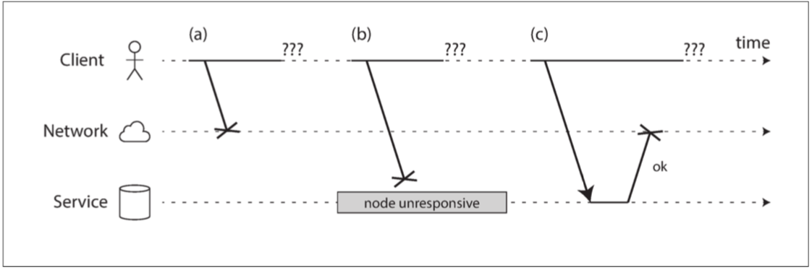
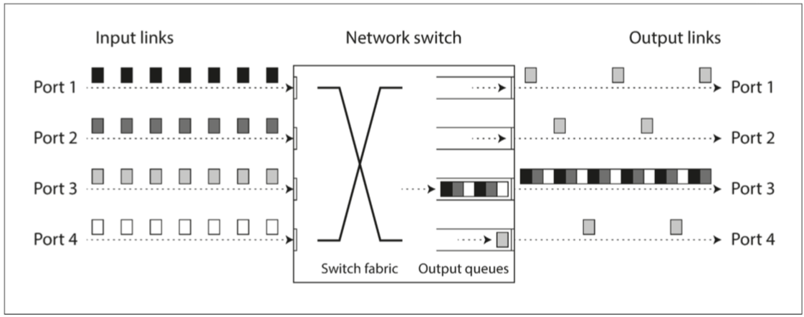
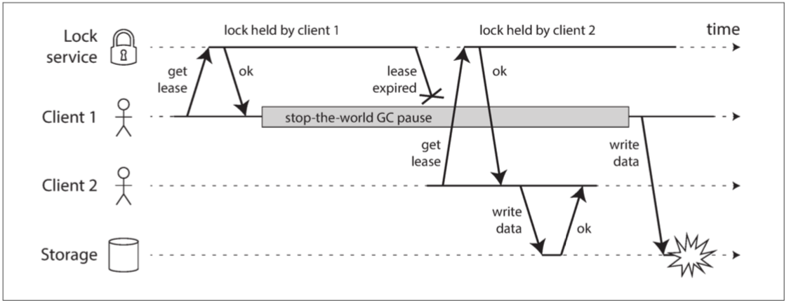

# 第八章：分布式系统的麻烦


> 邂逅相遇
>
> 网络延迟
>
> 存之为吾
>
> 无食我数
>
> ​				—— Kyle Kingsbury, Carly Rae Jepsen 《网络分区的危害》（2013年）[^译著1]

---------

[TOC]

​	最近几章中反复出现的主题是，系统如何处理错误的事情。例如，我们讨论了**副本故障切换**（“[处理节点中断](ch5.md#处理节点宕机)”），**复制延迟**（“[复制延迟问题](ch5.md#复制延迟问题)”）和事务控制（“[弱隔离级别](ch7.md#弱隔离级别)”）。当我们了解可能在实际系统中出现的各种边缘情况时，我们会更好地处理它们。

​	但是，尽管我们已经谈了很多错误，但之前几章仍然过于乐观。现实更加黑暗。我们现在将悲观主义最大化，假设任何可能出错的东西**都会**出错[^i]。（经验丰富的系统运维会告诉你，这是一个合理的假设。如果你问得好，他们可能会一边治疗心理创伤一边告诉你一些可怕的故事）

[^i]: 除了一个例外：我们将假定故障是非拜占庭式的（请参阅“[拜占庭故障](#拜占庭故障)”）。

​	使用分布式系统与在一台计算机上编写软件有着根本的区别，主要的区别在于，有许多新颖和刺激的方法可以使事情出错【1,2】。在这一章中，我们将了解实践中出现的问题，理解我们能够依赖，和不可以依赖的东西。

​	最后，作为工程师，我们的任务是构建能够完成工作的系统（即满足用户期望的保证），尽管一切都出错了。 在[第九章](ch9.md)中，我们将看看一些可以在分布式系统中提供这种保证的算法的例子。 但首先，在本章中，我们必须了解我们面临的挑战。

​	本章对分布式系统中可能出现的问题进行彻底的悲观和沮丧的总结。 我们将研究网络的问题（“[不可靠的网络](#不可靠的网络)”）; 时钟和时序问题（“[不可靠的时钟](#不可靠的时钟)”）; 我们将讨论他们可以避免的程度。 所有这些问题的后果都是困惑的，所以我们将探索如何思考一个分布式系统的状态，以及如何推理发生的事情（“[知识、真相与谎言](#知识、真相与谎言)”）。


## 故障与部分失效

​	当你在一台计算机上编写一个程序时，它通常会以一种相当可预测的方式运行：无论是工作还是不工作。充满错误的软件可能会让人觉得电脑有时候也会有“糟糕的一天”（这种问题通常是重新启动就恢复了），但这主要是软件写得不好的结果。

​	单个计算机上的软件没有根本性的不可靠原因：当硬件正常工作时，相同的操作总是产生相同的结果（这是确定性的）。如果存在硬件问题（例如，内存损坏或连接器松动），其后果通常是整个系统故障（例如，内核恐慌，“蓝屏死机”，启动失败）。装有良好软件的个人计算机通常要么功能完好，要么完全失效，而不是介于两者之间。

​	这是计算机设计中的一个有意的选择：如果发生内部错误，我们宁愿电脑完全崩溃，而不是返回错误的结果，因为错误的结果很难处理。因为计算机隐藏了模糊不清的物理实现，并呈现出一个理想化的系统模型，并以数学一样的完美的方式运作。 CPU指令总是做同样的事情；如果您将一些数据写入内存或磁盘，那么这些数据将保持不变，并且不会被随机破坏。从第一台数字计算机开始，*始终正确地计算*这个设计目标贯穿始终【3】。

​	当你编写运行在多台计算机上的软件时，情况有本质上的区别。在分布式系统中，我们不再处于理想化的系统模型中，我们别无选择，只能面对现实世界的混乱现实。而在现实世界中，各种各样的事情都可能会出现问题【4】，如下面的轶事所述：

> ​	在我有限的经验中，我已经和很多东西打过交道：单个**数据中心（DC）** 中长期存在的网络分区，配电单元PDU故障，交换机故障，整个机架的意外重启，整个数据中心主干网络故障，整个数据中心的电源故障，以及一个低血糖的司机把他的福特皮卡撞在数据中心的HVAC（加热，通风和空调）系统上。而且我甚至不是一个运维。
>
> ——柯达黑尔

​	在分布式系统中，尽管系统的其他部分工作正常，但系统的某些部分可能会以某种不可预知的方式被破坏。这被称为**部分失效（partial failure）**。难点在于部分失效是**不确定性的（nonderterministic）**：如果你试图做任何涉及多个节点和网络的事情，它有时可能会工作，有时会出现不可预知的失败。正如我们将要看到的，你甚至不知道是否成功了，因为消息通过网络传播的时间也是不确定的！

​	这种不确定性和部分失效的可能性，使得分布式系统难以工作【5】。

### 云计算与超级计算机

关于如何构建大型计算系统有一系列的哲学：

* 一个极端是高性能计算（HPC）领域。具有数千个CPU的超级计算机通常用于计算密集型科学计算任务，如天气预报或分子动力学（模拟原子和分子的运动）。
* 另一个极端是**云计算（cloud computing）**，云计算并不是一个良好定义的概念【6】，但通常与多租户数据中心，连接IP网络（通常是以太网）的商用计算机，弹性/按需资源分配以及计量计费等相关联。
* 传统企业数据中心位于这两个极端之间。

不同的哲学会导致不同的故障处理方式。在超级计算机中，作业通常会不时地会将计算的状态存盘到持久存储中。如果一个节点出现故障，通常的解决方案是简单地停止整个集群的工作负载。故障节点修复后，计算从上一个检查点重新开始【7,8】。因此，超级计算机更像是一个单节点计算机而不是分布式系统：通过让部分失败升级为完全失败来处理部分失败——如果系统的任何部分发生故障，只是让所有的东西都崩溃（就像单台机器上的内核恐慌一样）。

在本书中，我们将重点放在实现互联网服务的系统上，这些系统通常与超级计算机看起来有很大不同：

* 许多与互联网有关的应用程序都是**在线（online）** 的，因为它们需要能够随时以低延迟服务用户。使服务不可用（例如，停止集群以进行修复）是不可接受的。相比之下，像天气模拟这样的离线（批处理）工作可以停止并重新启动，影响相当小。

* 超级计算机通常由专用硬件构建而成，每个节点相当可靠，节点通过共享内存和**远程直接内存访问（RDMA）** 进行通信。另一方面，云服务中的节点是由商用机器构建而成的，由于规模经济，可以以较低的成本提供相同的性能，而且具有较高的故障率。

* 大型数据中心网络通常基于IP和以太网，以CLOS拓扑排列，以提供更高的对分（bisection）带宽【9】。超级计算机通常使用专门的网络拓扑结构，例如多维网格和Torus网络 【10】，这为具有已知通信模式的HPC工作负载提供了更好的性能。

* 系统越大，其组件之一就越有可能坏掉。随着时间的推移，坏掉的东西得到修复，新的东西又坏掉，但是在一个有成千上万个节点的系统中，有理由认为总是有一些东西是坏掉的【7】。当错误处理的策略只由简单放弃组成时，一个大的系统最终会花费大量时间从错误中恢复，而不是做有用的工作【8】。

* 如果系统可以容忍发生故障的节点，并继续保持整体工作状态，那么这对于运营和维护非常有用：例如，可以执行滚动升级（请参阅[第四章](ch4.md)），一次重新启动一个节点，同时继续给用户提供不中断的服务。在云环境中，如果一台虚拟机运行不佳，可以杀死它并请求一台新的虚拟机（希望新的虚拟机速度更快）。

* 在地理位置分散的部署中（保持数据在地理位置上接近用户以减少访问延迟），通信很可能通过互联网进行，与本地网络相比，通信速度缓慢且不可靠。超级计算机通常假设它们的所有节点都靠近在一起。

如果要使分布式系统工作，就必须接受部分故障的可能性，并在软件中建立容错机制。换句话说，我们需要从不可靠的组件构建一个可靠的系统。 （正如“[可靠性](ch1.md#可靠性)”中所讨论的那样，没有完美的可靠性，所以我们需要理解我们可以实际承诺的极限。）

​	即使在只有少数节点的小型系统中，考虑部分故障也是很重要的。在一个小系统中，很可能大部分组件在大部分时间都正常工作。然而，迟早会有一部分系统出现故障，软件必须以某种方式处理。故障处理必须是软件设计的一部分，并且作为软件的运维，您需要知道在发生故障的情况下，软件可能会表现出怎样的行为。

​	简单地假设缺陷很罕见并希望始终保持最好的状况是不明智的。考虑一系列可能的错误（甚至是不太可能的错误），并在测试环境中人为地创建这些情况来查看会发生什么是非常重要的。在分布式系统中，怀疑，悲观和偏执狂是值得的。

> #### 从不可靠的组件构建可靠的系统
>
> 您可能想知道这是否有意义——直观地看来，系统只能像其最不可靠的组件（最薄弱的环节）一样可靠。事实并非如此：事实上，从不太可靠的潜在基础构建更可靠的系统是计算机领域的一个古老思想【11】。例如：
>
> * 纠错码允许数字数据在通信信道上准确传输，偶尔会出现一些错误，例如由于无线网络上的无线电干扰【12】。
> * **互联网协议（Internet Protocol, IP）** 不可靠：可能丢弃，延迟，重复或重排数据包。 传输控制协议（Transmission Control Protocol, TCP）在互联网协议（IP）之上提供了更可靠的传输层：它确保丢失的数据包被重新传输，消除重复，并且数据包被重新组装成它们被发送的顺序。
>
> 虽然这个系统可以比它的底层部分更可靠，但它的可靠性总是有限的。例如，纠错码可以处理少量的单比特错误，但是如果你的信号被干扰所淹没，那么通过信道可以得到多少数据，是有根本性的限制的【13】。 TCP可以隐藏数据包的丢失，重复和重新排序，但是它不能神奇地消除网络中的延迟。
>
> 虽然更可靠的高级系统并不完美，但它仍然有用，因为它处理了一些棘手的低级错误，所以其余的错误通常更容易推理和处理。我们将在“[数据库的端到端原则](ch12.md#数据库的端到端原则)”中进一步探讨这个问题。


## 不可靠的网络

​	正如在[第二部分](part-ii.md)的介绍中所讨论的那样，我们在本书中关注的分布式系统是无共享的系统，即通过网络连接的一堆机器。网络是这些机器可以通信的唯一途径——我们假设每台机器都有自己的内存和磁盘，一台机器不能访问另一台机器的内存或磁盘（除了通过网络向服务器发出请求）。

​	**无共享**并不是构建系统的唯一方式，但它已经成为构建互联网服务的主要方式，其原因如下：相对便宜，因为它不需要特殊的硬件，可以利用商品化的云计算服务，通过跨多个地理分布的数据中心进行冗余可以实现高可靠性。

​	互联网和数据中心（通常是以太网）中的大多数内部网络都是**异步分组网络（asynchronous packet networks）**。在这种网络中，一个节点可以向另一个节点发送一个消息（一个数据包），但是网络不能保证它什么时候到达，或者是否到达。如果您发送请求并期待响应，则很多事情可能会出错（其中一些如[图8-1](img/fig8-1.png)所示）：

1. 请求可能已经丢失（可能有人拔掉了网线）。
2. 请求可能正在排队，稍后将交付（也许网络或接收方过载）。
3. 远程节点可能已经失效（可能是崩溃或关机）。
4. 远程节点可能暂时停止了响应（可能会遇到长时间的垃圾回收暂停；请参阅“[进程暂停](#进程暂停)”），但稍后会再次响应。
5. 远程节点可能已经处理了请求，但是网络上的响应已经丢失（可能是网络交换机配置错误）。
6. 远程节点可能已经处理了请求，但是响应已经被延迟，并且稍后将被传递（可能是网络或者你自己的机器过载）。



**图8-1 如果发送请求并没有得到响应，则无法区分（a）请求是否丢失，（b）远程节点是否关闭，或（c）响应是否丢失。**

​	发送者甚至不能分辨数据包是否被发送：唯一的选择是让接收者发送响应消息，这可能会丢失或延迟。这些问题在异步网络中难以区分：您所拥有的唯一信息是，您尚未收到响应。如果您向另一个节点发送请求并且没有收到响应，则不可能判断是什么原因。

​	处理这个问题的通常方法是**超时（Timeout）**：在一段时间之后放弃等待，并且认为响应不会到达。但是，当发生超时时，你仍然不知道远程节点是否收到了请求（如果请求仍然在某个地方排队，那么即使发送者已经放弃了该请求，仍然可能会将其发送给接收者）。

### 真实世界的网络故障

​	我们几十年来一直在建设计算机网络——有人可能希望现在我们已经找出了使网络变得可靠的方法。但是现在似乎还没有成功。

​	有一些系统的研究和大量的轶事证据表明，即使在像一家公司运营的数据中心那样的受控环境中，网络问题也可能出乎意料地普遍。在一家中型数据中心进行的一项研究发现，每个月大约有12个网络故障，其中一半断开一台机器，一半断开整个机架【15】。另一项研究测量了架顶式交换机，汇聚交换机和负载平衡器等组件的故障率【16】。它发现添加冗余网络设备不会像您所希望的那样减少故障，因为它不能防范人为错误（例如，错误配置的交换机），这是造成中断的主要原因。

​	诸如EC2之类的公有云服务因频繁的暂态网络故障而臭名昭着【14】，管理良好的私有数据中心网络可能是更稳定的环境。尽管如此，没有人不受网络问题的困扰：例如，交换机软件升级过程中的一个问题可能会引发网络拓扑重构，在此期间网络数据包可能会延迟超过一分钟【17】。鲨鱼可能咬住海底电缆并损坏它们 【18】。其他令人惊讶的故障包括网络接口有时会丢弃所有入站数据包，但是成功发送出站数据包 【19】：仅仅因为网络链接在一个方向上工作，并不能保证它也在相反的方向工作。

> #### 网络分区
>
> ​	当网络的一部分由于网络故障而被切断时，有时称为**网络分区（network partition）** 或**网络断裂（netsplit）**。在本书中，我们通常会坚持使用更一般的术语**网络故障（network fault）**，以避免与[第六章](ch6.md)讨论的存储系统的分区（分片）相混淆。

​	即使网络故障在你的环境中非常罕见，故障可能发生的事实，意味着你的软件需要能够处理它们。无论何时通过网络进行通信，都可能会失败，这是无法避免的。

​	如果网络故障的错误处理没有定义与测试，武断地讲，各种错误可能都会发生：例如，即使网络恢复【20】，集群可能会发生**死锁**，永久无法为请求提供服务，甚至可能会删除所有的数据【21】。如果软件被置于意料之外的情况下，它可能会做出出乎意料的事情。

​	处理网络故障并不意味着容忍它们：如果你的网络通常是相当可靠的，一个有效的方法可能是当你的网络遇到问题时，简单地向用户显示一条错误信息。但是，您确实需要知道您的软件如何应对网络问题，并确保系统能够从中恢复。有意识地触发网络问题并测试系统响应（这是Chaos Monkey背后的想法；请参阅“[可靠性](ch1.md#可靠性)”）。

### 检测故障

许多系统需要自动检测故障节点。例如：

* 负载平衡器需要停止向已死亡的节点转发请求（即从**移出轮询列表（out of rotation）**）。
* 在单主复制功能的分布式数据库中，如果主库失效，则需要将从库之一升级为新主库（请参阅“[处理节点宕机](ch5.md#处理节点宕机)”）。

不幸的是，网络的不确定性使得很难判断一个节点是否工作。在某些特定的情况下，您可能会收到一些反馈信息，明确告诉您某些事情没有成功：

* 如果你可以连接到运行节点的机器，但没有进程正在侦听目标端口（例如，因为进程崩溃），操作系统将通过发送FIN或RST来关闭并重用TCP连接。但是，如果节点在处理请求时发生崩溃，则无法知道远程节点实际处理了多少数据【22】。
* 如果节点进程崩溃（或被管理员杀死），但节点的操作系统仍在运行，则脚本可以通知其他节点有关该崩溃的信息，以便另一个节点可以快速接管，而无需等待超时到期。例如，HBase就是这么做的【23】。
* 如果您有权访问数据中心网络交换机的管理界面，则可以通过它们检测硬件级别的链路故障（例如，远程机器是否关闭电源）。如果您通过互联网连接，或者如果您处于共享数据中心而无法访问交换机，或者由于网络问题而无法访问管理界面，则排除此选项。
* 如果路由器确认您尝试连接的IP地址不可用，则可能会使用ICMP目标不可达数据包回复您。但是，路由器不具备神奇的故障检测能力——它受到与网络其他参与者相同的限制。

关于远程节点关闭的快速反馈很有用，但是你不能指望它。即使TCP确认已经传送了一个数据包，应用程序在处理之前可能已经崩溃。如果你想确保一个请求是成功的，你需要应用程序本身的正确响应【24】。

​	相反，如果出了什么问题，你可能会在堆栈的某个层次上得到一个错误响应，但总的来说，你必须假设你可能根本就得不到任何回应。您可以重试几次（TCP重试是透明的，但是您也可以在应用程序级别重试），等待超时过期，并且如果在超时时间内没有收到响应，则最终声明节点已经死亡。

### 超时与无穷的延迟

​	如果超时是检测故障的唯一可靠方法，那么超时应该等待多久？不幸的是没有简单的答案。

​	长时间的超时意味着长时间等待，直到一个节点被宣告死亡（在这段时间内，用户可能不得不等待，或者看到错误信息）。短的超时可以更快地检测到故障，但有更高地风险误将一个节点宣布为失效，而该节点实际上只是暂时地变慢了（例如由于节点或网络上的负载峰值）。

​	过早地声明一个节点已经死了是有问题的：如果这个节点实际上是活着的，并且正在执行一些动作（例如，发送一封电子邮件），而另一个节点接管，那么这个动作可能会最终执行两次。我们将在“[知识、真相与谎言](#知识、真相与谎言)”以及[第九章](ch9.md)和[第十一章](ch11.md)中更详细地讨论这个问题。

​	当一个节点被宣告死亡时，它的职责需要转移到其他节点，这会给其他节点和网络带来额外的负担。如果系统已经处于高负荷状态，则过早宣告节点死亡会使问题更严重。特别是如果节点实际上没有死亡，只是由于过载导致其响应缓慢；这时将其负载转移到其他节点可能会导致**级联失效（cascading failure）**（在极端情况下，所有节点都宣告对方死亡，所有节点都将停止工作）。

​	设想一个虚构的系统，其网络可以保证数据包的最大延迟——每个数据包要么在一段时间内传送，要么丢失，但是传递永远不会比$d$更长。此外，假设你可以保证一个非故障节点总是在一段时间内处理一个请求$r$。在这种情况下，您可以保证每个成功的请求在$2d + r$时间内都能收到响应，如果您在此时间内没有收到响应，则知道网络或远程节点不工作。如果这是成立的，$2d + r$ 会是一个合理的超时设置。

​	不幸的是，我们所使用的大多数系统都没有这些保证：异步网络具有无限的延迟（即尽可能快地传送数据包，但数据包到达可能需要的时间没有上限），并且大多数服务器实现并不能保证它们可以在一定的最大时间内处理请求（请参阅“[响应时间保证](#响应时间保证)”）。对于故障检测，即使系统大部分时间快速运行也是不够的：如果你的超时时间很短，往返时间只需要一个瞬时尖峰就可以使系统失衡。

#### 网络拥塞和排队

​	在驾驶汽车时，由于交通拥堵，道路交通网络的通行时间往往不尽相同。同样，计算机网络上数据包延迟的可变性通常是由于排队【25】：

* 如果多个不同的节点同时尝试将数据包发送到同一目的地，则网络交换机必须将它们排队并将它们逐个送入目标网络链路（如[图8-2](img/fig8-2.png)所示）。在繁忙的网络链路上，数据包可能需要等待一段时间才能获得一个插槽（这称为网络拥塞）。如果传入的数据太多，交换机队列填满，数据包将被丢弃，因此需要重新发送数据包 - 即使网络运行良好。
* 当数据包到达目标机器时，如果所有CPU内核当前都处于繁忙状态，则来自网络的传入请求将被操作系统排队，直到应用程序准备好处理它为止。根据机器上的负载，这可能需要一段任意的时间。
* 在虚拟化环境中，正在运行的操作系统经常暂停几十毫秒，因为另一个虚拟机正在使用CPU内核。在这段时间内，虚拟机不能从网络中消耗任何数据，所以传入的数据被虚拟机监视器 【26】排队（缓冲），进一步增加了网络延迟的可变性。
* TCP执行**流量控制（flow control）**（也称为**拥塞避免（congestion avoidance）** 或**背压（backpressure）**），其中节点会限制自己的发送速率以避免网络链路或接收节点过载【27】。这意味着甚至在数据进入网络之前，在发送者处就需要进行额外的排队。



**图8-2 如果有多台机器将网络流量发送到同一目的地，则其交换机队列可能会被填满。在这里，端口1,2和4都试图发送数据包到端口3**

​	而且，如果TCP在某个超时时间内没有被确认（这是根据观察的往返时间计算的），则认为数据包丢失，丢失的数据包将自动重新发送。尽管应用程序没有看到数据包丢失和重新传输，但它看到了延迟（等待超时到期，然后等待重新传输的数据包得到确认）。


> ### TCP与UDP
>
> ​	一些对延迟敏感的应用程序（如视频会议和IP语音（VoIP））使用UDP而不是TCP。这是在可靠性和和延迟变化之间的折衷：由于UDP不执行流量控制并且不重传丢失的分组，所以避免了网络延迟变化的一些原因（尽管它仍然易受切换队列和调度延迟的影响）。
>
> ​	在延迟数据毫无价值的情况下，UDP是一个不错的选择。例如，在VoIP电话呼叫中，可能没有足够的时间重新发送丢失的数据包，并在扬声器上播放数据。在这种情况下，重发数据包没有意义——应用程序必须使用静音填充丢失数据包的时隙（导致声音短暂中断），然后在数据流中继续。重试发生在人类层。 （“你能再说一遍吗？声音刚刚断了一会儿。“）

​	所有这些因素都会造成网络延迟的变化。当系统接近其最大容量时，排队延迟的变化范围特别大：拥有足够备用容量的系统可以轻松排空队列，而在高利用率的系统中，很快就能积累很长的队列。

​	在公共云和多租户数据中心中，资源被许多客户共享：网络链接和交换机，甚至每个机器的网卡和CPU（在虚拟机上运行时）。批处理工作负载（如MapReduce）（请参阅[第十章](ch10.md)）能够很容易使网络链接饱和。由于无法控制或了解其他客户对共享资源的使用情况，如果附近的某个人（嘈杂的邻居）正在使用大量资源，则网络延迟可能会发生剧烈变化【28,29】。

​	在这种环境下，您只能通过实验方式选择超时：在一段较长的时期内、在多台机器上测量网络往返时间的分布，以确定延迟的预期变化。然后，考虑到应用程序的特性，可以确定**故障检测延迟**与**过早超时风险**之间的适当折衷。

​	更好的一种做法是，系统不是使用配置的常量超时时间，而是连续测量响应时间及其变化（抖动），并根据观察到的响应时间分布自动调整超时时间。这可以通过Phi Accrual故障检测器【30】来完成，该检测器在例如Akka和Cassandra 【31】中使用。 TCP的超时重传机制也是以类似的方式工作【27】。

### 同步网络与异步网络

​	如果我们可以依靠网络来传递一些**最大延迟固定**的数据包，而不是丢弃数据包，那么分布式系统就会简单得多。为什么我们不能在硬件层面上解决这个问题，使网络可靠，使软件不必担心呢？

​	为了回答这个问题，将数据中心网络与非常可靠的传统固定电话网络（非蜂窝，非VoIP）进行比较是很有趣的：延迟音频帧和掉话是非常罕见的。一个电话需要一个很低的端到端延迟，以及足够的带宽来传输你声音的音频采样数据。在计算机网络中有类似的可靠性和可预测性不是很好吗？

​	当您通过电话网络拨打电话时，它会建立一个电路：在两个呼叫者之间的整个路线上为呼叫分配一个固定的，有保证的带宽量。这个电路会保持至通话结束【32】。例如，ISDN网络以每秒4000帧的固定速率运行。呼叫建立时，每个帧内（每个方向）分配16位空间。因此，在通话期间，每一方都保证能够每250微秒发送一个精确的16位音频数据【33,34】。

​	这种网络是同步的：即使数据经过多个路由器，也不会受到排队的影响，因为呼叫的16位空间已经在网络的下一跳中保留了下来。而且由于没有排队，网络的最大端到端延迟是固定的。我们称之为**有限延迟（bounded delay）**。

#### 我们不能简单地使网络延迟可预测吗？

​	请注意，电话网络中的电路与TCP连接有很大不同：电路是固定数量的预留带宽，在电路建立时没有其他人可以使用，而TCP连接的数据包**机会性地**使用任何可用的网络带宽。您可以给TCP一个可变大小的数据块（例如，一个电子邮件或一个网页），它会尽可能在最短的时间内传输它。 TCP连接空闲时，不使用任何带宽[^ii]。

[^ii]: 除了偶尔的keepalive数据包，如果TCP keepalive被启用。

​	如果数据中心网络和互联网是电路交换网络，那么在建立电路时就可以建立一个受保证的最大往返时间。但是，它们并不是：以太网和IP是**分组交换协议**，不得不忍受排队的折磨，及其导致的网络无限延迟。这些协议没有电路的概念。

​	为什么数据中心网络和互联网使用分组交换？答案是，它们针对**突发流量（bursty traffic）** 进行了优化。一个电路适用于音频或视频通话，在通话期间需要每秒传送相当数量的比特。另一方面，请求网页，发送电子邮件或传输文件没有任何特定的带宽要求——我们只是希望它尽快完成。

​	如果想通过电路传输文件，你得预测一个带宽分配。如果你猜的太低，传输速度会不必要的太慢，导致网络容量闲置。如果你猜的太高，电路就无法建立（因为如果无法保证其带宽分配，网络不能建立电路）。因此，将电路用于突发数据传输会浪费网络容量，并且使传输不必要地缓慢。相比之下，TCP动态调整数据传输速率以适应可用的网络容量。

​	已经有一些尝试去建立同时支持电路交换和分组交换的混合网络，比如ATM[^iii]。InfiniBand有一些相似之处【35】：它在链路层实现了端到端的流量控制，从而减少了在网络中排队的需要，尽管它仍然可能因链路拥塞而受到延迟【36】。通过仔细使用**服务质量（quality of service,）**（QoS，数据包的优先级和调度）和**准入控制（admission control）**（限速发送器），可以在分组网络上模拟电路交换，或提供统计上的**有限延迟**【25,32】。

[^iii]: **异步传输模式（Asynchronous Transfer Mode, ATM）** 在20世纪80年代是以太网的竞争对手【32】，但在电话网核心交换机之外并没有得到太多的采用。它与自动柜员机（也称为自动取款机）无关，尽管共用一个缩写词。或许，在一些平行的世界里，互联网是基于像ATM这样的东西，因此它们的互联网视频通话可能比我们的更可靠，因为它们不会遭受包的丢失和延迟。

​	但是，目前在多租户数据中心和公共云或通过互联网[^iv]进行通信时，此类服务质量尚未启用。当前部署的技术不允许我们对网络的延迟或可靠性作出任何保证：我们必须假设网络拥塞，排队和无限的延迟总是会发生。因此，超时时间没有“正确”的值——它需要通过实验来确定。

[^iv]: 互联网服务提供商之间的对等协议和通过**BGP网关协议（BGP）** 建立的路由，与IP协议相比，更接近于电路交换。在这个级别上，可以购买专用带宽。但是，互联网路由在网络级别运行，而不是主机之间的单独连接，而且运行时间要长得多。

> ### 延迟和资源利用
>
> ​	更一般地说，可以将**延迟变化**视为**动态资源分区**的结果。
>
> ​	假设两台电话交换机之间有一条线路，可以同时进行10,000个呼叫。通过此线路切换的每个电路都占用其中一个呼叫插槽。因此，您可以将线路视为可由多达10,000个并发用户共享的资源。资源以静态方式分配：即使您现在是电话上唯一的电话，并且所有其他9,999个插槽都未使用，您的电路仍将分配与导线充分利用时相同的固定数量的带宽。
>
> ​	相比之下，互联网动态分享网络带宽。发送者互相推挤和争夺，以让他们的数据包尽可能快地通过网络，并且网络交换机决定从一个时刻到另一个时刻发送哪个分组（即，带宽分配）。这种方法有排队的缺点，但其优点是它最大限度地利用了电线。电线固定成本，所以如果你更好地利用它，你通过电线发送的每个字节都会更便宜。
>
> ​	CPU也会出现类似的情况：如果您在多个线程间动态共享每个CPU内核，则一个线程有时必须在操作系统的运行队列里等待，而另一个线程正在运行，这样每个线程都有可能被暂停一个不定的时间长度。但是，与为每个线程分配静态数量的CPU周期相比，这会更好地利用硬件（请参阅“[响应时间保证](#响应时间保证)”）。更好的硬件利用率也是使用虚拟机的重要动机。
>
> ​	如果资源是静态分区的（例如，专用硬件和专用带宽分配），则在某些环境中可以实现**延迟保证**。但是，这是以降低利用率为代价的——换句话说，它是更昂贵的。另一方面，动态资源分配的多租户提供了更好的利用率，所以它更便宜，但它具有可变延迟的缺点。
>
> ​	网络中的可变延迟不是一种自然规律，而只是成本/收益权衡的结果。


## 不可靠的时钟

时钟和时间很重要。应用程序以各种方式依赖于时钟来回答以下问题：

1. 这个请求是否超时了？
2. 这项服务的第99百分位响应时间是多少？
3. 在过去五分钟内，该服务平均每秒处理多少个查询？
4. 用户在我们的网站上花了多长时间？
5. 这篇文章在何时发布？
6. 在什么时间发送提醒邮件？
7. 这个缓存条目何时到期？
8. 日志文件中此错误消息的时间戳是什么？

[例1-4](ch1.md)测量了**持续时间（durations）**（例如，请求发送与响应接收之间的时间间隔），而[例5-8](ch5.md)描述了**时间点（point in time）**（在特定日期，特定时间发生的事件）。

​	在分布式系统中，时间是一件棘手的事情，因为通信不是即时的：消息通过网络从一台机器传送到另一台机器需要时间。收到消息的时间总是晚于发送的时间，但是由于网络中的可变延迟，我们不知道晚了多少时间。这个事实导致有时很难确定在涉及多台机器时发生事情的顺序。

​	而且，网络上的每台机器都有自己的时钟，这是一个实际的硬件设备：通常是石英晶体振荡器。这些设备不是完全准确的，所以每台机器都有自己的时间概念，可能比其他机器稍快或更慢。可以在一定程度上同步时钟：最常用的机制是**网络时间协议（NTP）**，它允许根据一组服务器报告的时间来调整计算机时钟【37】。服务器则从更精确的时间源（如GPS接收机）获取时间。

### 单调钟与日历时钟

​	现代计算机至少有两种不同的时钟：日历时钟（time-of-day clock）和单调钟（monotonic clock）。尽管它们都衡量时间，但区分这两者很重要，因为它们有不同的目的。

#### 日历时钟

​	日历时钟是您直观地了解时钟的依据：它根据某个日历（也称为**挂钟时间（wall-clock time）**）返回当前日期和时间。例如，Linux上的`clock_gettime(CLOCK_REALTIME)`[^v]和Java中的`System.currentTimeMillis()`返回自epoch（UTC时间1970年1月1日午夜）以来的秒数（或毫秒），根据公历（Gregorian）日历，不包括闰秒。有些系统使用其他日期作为参考点。

[^v]: 虽然该时钟被称为实时时钟，但它与实时操作系统无关，如“[响应时间保证](#响应时间保证)”中所述。

​	日历时钟通常与NTP同步，这意味着来自一台机器的时间戳（理想情况下）与另一台机器上的时间戳相同。但是如下节所述，日历时钟也具有各种各样的奇特之处。特别是，如果本地时钟在NTP服务器之前太远，则它可能会被强制重置，看上去好像跳回了先前的时间点。这些跳跃以及他们经常忽略闰秒的事实，使日历时钟不能用于测量经过时间（elapsed time）【38】。

​	历史上的日历时钟还具有相当粗略的分辨率，例如，在较早的Windows系统上以10毫秒为单位前进【39】。在最近的系统中这已经不是一个问题了。

#### 单调钟

​	单调钟适用于测量持续时间（时间间隔），例如超时或服务的响应时间：Linux上的`clock_gettime(CLOCK_MONOTONIC)`，和Java中的`System.nanoTime()`都是单调时钟。这个名字来源于他们保证总是往前走的事实（而日历时钟可以往回跳）。

​	你可以在某个时间点检查单调钟的值，做一些事情，且稍后再次检查它。这两个值之间的差异告诉你两次检查之间经过了多长时间。但单调钟的绝对值是毫无意义的：它可能是计算机启动以来的纳秒数，或类似的任意值。特别是比较来自两台不同计算机的单调钟的值是没有意义的，因为它们并不是一回事。

​	在具有多个CPU插槽的服务器上，每个CPU可能有一个单独的计时器，但不一定与其他CPU同步。操作系统会补偿所有的差异，并尝试向应用线程表现出单调钟的样子，即使这些线程被调度到不同的CPU上。当然，明智的做法是不要太把这种单调性保证当回事【40】。

​	如果NTP协议检测到计算机的本地石英钟比NTP服务器要更快或更慢，则可以调整单调钟向前走的频率（这称为**偏移（skewing）** 时钟）。默认情况下，NTP允许时钟速率增加或减慢最高至0.05％，但NTP不能使单调时钟向前或向后跳转。单调时钟的分辨率通常相当好：在大多数系统中，它们能在几微秒或更短的时间内测量时间间隔。

​	在分布式系统中，使用单调钟测量**经过时间（elapsed time）**（比如超时）通常很好，因为它不假定不同节点的时钟之间存在任何同步，并且对测量的轻微不准确性不敏感。

### 时钟同步与准确性

​	单调钟不需要同步，但是日历时钟需要根据NTP服务器或其他外部时间源来设置才能有用。不幸的是，我们获取时钟的方法并不像你所希望的那样可靠或准确——硬件时钟和NTP可能会变幻莫测。举几个例子：

* 计算机中的石英钟不够精确：它会**漂移（drifts）**（运行速度快于或慢于预期）。时钟漂移取决于机器的温度。 Google假设其服务器时钟漂移为200 ppm（百万分之一）【41】，相当于每30秒与服务器重新同步一次的时钟漂移为6毫秒，或者每天重新同步的时钟漂移为17秒。即使一切工作正常，此漂移也会限制可以达到的最佳准确度。
* 如果计算机的时钟与NTP服务器的时钟差别太大，可能会拒绝同步，或者本地时钟将被强制重置【37】。任何观察重置前后时间的应用程序都可能会看到时间倒退或突然跳跃。
* 如果某个节点被NTP服务器的防火墙意外阻塞，有可能会持续一段时间都没有人会注意到。有证据表明，这在实践中确实发生过。
* NTP同步只能和网络延迟一样好，所以当您在拥有可变数据包延迟的拥塞网络上时，NTP同步的准确性会受到限制。一个实验表明，当通过互联网同步时，35毫秒的最小误差是可以实现的，尽管偶尔的网络延迟峰值会导致大约一秒的误差。根据配置，较大的网络延迟会导致NTP客户端完全放弃。
* 一些NTP服务器是错误的或者配置错误的，报告的时间可能相差几个小时【43,44】。还好NTP客户端非常健壮，因为他们会查询多个服务器并忽略异常值。无论如何，依赖于互联网上的陌生人所告诉你的时间来保证你的系统的正确性，这还挺让人担忧的。
* 闰秒导致一分钟可能有59秒或61秒，这会打破一些在设计之时未考虑闰秒的系统的时序假设【45】。闰秒已经使许多大型系统崩溃的事实【38,46】说明了，关于时钟的错误假设是多么容易偷偷溜入系统中。处理闰秒的最佳方法可能是让NTP服务器“撒谎”，并在一天中逐渐执行闰秒调整（这被称为**拖尾（smearing）**）【47,48】，虽然实际的NTP服务器表现各异【49】。
* 在虚拟机中，硬件时钟被虚拟化，这对于需要精确计时的应用程序提出了额外的挑战【50】。当一个CPU核心在虚拟机之间共享时，每个虚拟机都会暂停几十毫秒，与此同时另一个虚拟机正在运行。从应用程序的角度来看，这种停顿表现为时钟突然向前跳跃【26】。
* 如果您在没有完整控制权的设备（例如，移动设备或嵌入式设备）上运行软件，则可能完全不能信任该设备的硬件时钟。一些用户故意将其硬件时钟设置为不正确的日期和时间，例如，为了规避游戏中的时间限制，时钟可能会被设置到很远的过去或将来。

如果你足够在乎这件事并投入大量资源，就可以达到非常好的时钟精度。例如，针对金融机构的欧洲法规草案MiFID II要求所有高频率交易基金在UTC时间100微秒内同步时钟，以便调试“闪崩”等市场异常现象，并帮助检测市场操纵【51】。

​	通过GPS接收机，精确时间协议（PTP）【52】以及仔细的部署和监测可以实现这种精确度。然而，这需要很多努力和专业知识，而且有很多东西都会导致时钟同步错误。如果你的NTP守护进程配置错误，或者防火墙阻止了NTP通信，由漂移引起的时钟误差可能很快就会变大。

### 依赖同步时钟

​	时钟的问题在于，虽然它们看起来简单易用，但却具有令人惊讶的缺陷：一天可能不会有精确的86,400秒，**日历时钟**可能会前后跳跃，而一个节点上的时间可能与另一个节点上的时间完全不同。

​	本章早些时候，我们讨论了网络丢包和任意延迟包的问题。尽管网络在大多数情况下表现良好，但软件的设计必须假定网络偶尔会出现故障，而软件必须正常处理这些故障。时钟也是如此：尽管大多数时间都工作得很好，但需要准备健壮的软件来处理不正确的时钟。

​	有一部分问题是，不正确的时钟很容易被视而不见。如果一台机器的CPU出现故障或者网络配置错误，很可能根本无法工作，所以很快就会被注意和修复。另一方面，如果它的石英时钟有缺陷，或者它的NTP客户端配置错误，大部分事情似乎仍然可以正常工作，即使它的时钟逐渐偏离现实。如果某个软件依赖于精确同步的时钟，那么结果更可能是悄无声息的，仅有微量的数据丢失，而不是一次惊天动地的崩溃【53,54】。

​	因此，如果你使用需要同步时钟的软件，必须仔细监控所有机器之间的时钟偏移。时钟偏离其他时钟太远的节点应当被宣告死亡，并从集群中移除。这样的监控可以确保你在损失发生之前注意到破损的时钟。

#### 有序事件的时间戳

​	让我们考虑一个特别的情况，一件很有诱惑但也很危险的事情：依赖时钟，在多个节点上对事件进行排序。 例如，如果两个客户端写入分布式数据库，谁先到达？ 哪一个更近？

​	[图8-3](img/fig8-3.png)显示了在具有多领导者复制的数据库中对时钟的危险使用（该例子类似于[图5-9](img/fig5-9.png)）。 客户端A在节点1上写入`x = 1`；写入被复制到节点3；客户端B在节点3上增加x（我们现在有`x = 2`）；最后这两个写入都被复制到节点2。


**图8-3 客户端B的写入比客户端A的写入要晚，但是B的写入具有较早的时间戳。**

​	在[图8-3](img/fig8-3.png)中，当一个写入被复制到其他节点时，它会根据发生写入的节点上的日历时钟标记一个时间戳。在这个例子中，时钟同步是非常好的：节点1和节点3之间的偏差小于3ms，这可能比你在实践中能预期的更好。

​	尽管如此，[图8-3](img/fig8-3.png)中的时间戳却无法正确排列事件：写入`x = 1`的时间戳为42.004秒，但写入`x = 2`的时间戳为42.003秒，即使`x = 2`在稍后出现。当节点2接收到这两个事件时，会错误地推断出`x = 1`是最近的值，而丢弃写入`x = 2`。效果上表现为，客户端B的增量操作会丢失。

​	这种冲突解决策略被称为**最后写入胜利（LWW）**，它在多领导者复制和无领导者数据库（如Cassandra 【53】和Riak 【54】）中被广泛使用（请参阅“[最后写入胜利（丢弃并发写入）](ch5.md#最后写入胜利（丢弃并发写入）)”一节）。有些实现会在客户端而不是服务器上生成时间戳，但这并不能改变LWW的基本问题：

* 数据库写入可能会神秘地消失：具有滞后时钟的节点无法覆盖之前具有快速时钟的节点写入的值，直到节点之间的时钟偏差消逝【54,55】。此方案可能导致一定数量的数据被悄悄丢弃，而未向应用报告任何错误。
* LWW无法区分**高频顺序写入**（在[图8-3](img/fig8-3.png)中，客户端B的增量操作**一定**发生在客户端A的写入之后）和**真正并发写入**（写入者意识不到其他写入者）。需要额外的因果关系跟踪机制（例如版本向量），以防止违背因果关系（请参阅“[检测并发写入](ch5.md#检测并发写入)”）。
* 两个节点很可能独立地生成具有相同时间戳的写入，特别是在时钟仅具有毫秒分辨率的情况下。为了解决这样的冲突，还需要一个额外的**决胜值（tiebreaker）**（可以简单地是一个大随机数），但这种方法也可能会导致违背因果关系【53】。

因此，尽管通过保留最“最近”的值并放弃其他值来解决冲突是很诱惑人的，但是要注意，“最近”的定义取决于本地的**日历时钟**，这很可能是不正确的。即使用严格同步的NTP时钟，一个数据包也可能在时间戳100毫秒（根据发送者的时钟）时发送，并在时间戳99毫秒（根据接收者的时钟）处到达——看起来好像数据包在发送之前已经到达，这是不可能的。

​	NTP同步是否能足够准确，以至于这种不正确的排序不会发生？也许不能，因为NTP的同步精度本身，除了石英钟漂移这类误差源之外，还受到网络往返时间的限制。为了进行正确的排序，你需要一个比测量对象（即网络延迟）要精确得多的时钟。

​	所谓的**逻辑时钟（logic clock）**【56,57】是基于递增计数器而不是振荡石英晶体，对于排序事件来说是更安全的选择（请参阅“[检测并发写入](ch5.md#检测并发写入)”）。逻辑时钟不测量一天中的时间或经过的秒数，而仅测量事件的相对顺序（无论一个事件发生在另一个事件之前还是之后）。相反，用来测量实际经过时间的**日历时钟**和**单调钟**也被称为**物理时钟（physical clock）**。我们将在“[顺序保证](ch9.md#顺序保证)”中来看顺序问题。

#### 时钟读数存在置信区间

​	您可能能够以微秒或甚至纳秒的精度读取机器的时钟。但即使可以得到如此细致的测量结果，这并不意味着这个值对于这样的精度实际上是准确的。实际上，大概率是不准确的——如前所述，即使您每分钟与本地网络上的NTP服务器进行同步，几毫秒的时间漂移也很容易在不精确的石英时钟上发生。使用公共互联网上的NTP服务器，最好的准确度可能达到几十毫秒，而且当网络拥塞时，误差可能会超过100毫秒【57】。

​	因此，将时钟读数视为一个时间点是没有意义的——它更像是一段时间范围：例如，一个系统可能以95％的置信度认为当前时间处于本分钟内的第10.3秒和10.5秒之间，它可能没法比这更精确了【58】。如果我们只知道±100毫秒的时间，那么时间戳中的微秒数字部分基本上是没有意义的。

​	不确定性界限可以根据你的时间源来计算。如果您的GPS接收器或原子（铯）时钟直接连接到您的计算机上，预期的错误范围由制造商告知。如果从服务器获得时间，则不确定性取决于自上次与服务器同步以来的石英钟漂移的期望值，加上NTP服务器的不确定性，再加上到服务器的网络往返时间（只是获取粗略近似值，并假设服务器是可信的）。

​	不幸的是，大多数系统不公开这种不确定性：例如，当调用`clock_gettime()`时，返回值不会告诉你时间戳的预期错误，所以你不知道其置信区间是5毫秒还是5年。

​	一个有趣的例外是Spanner中的Google TrueTime API 【41】，它明确地报告了本地时钟的置信区间。当你询问当前时间时，你会得到两个值：[最早，最晚]，这是最早可能的时间戳和最晚可能的时间戳。在不确定性估计的基础上，时钟知道当前的实际时间落在该区间内。区间的宽度取决于自从本地石英钟最后与更精确的时钟源同步以来已经过了多长时间。

#### 全局快照的同步时钟

​	在“[快照隔离和可重复读](ch7.md#快照隔离和可重复读)”中，我们讨论了快照隔离，这是数据库中非常有用的功能，需要支持小型快速读写事务和大型长时间运行的只读事务（用于备份或分析）。它允许只读事务看到特定时间点的处于一致状态的数据库，且不会锁定和干扰读写事务。

​	快照隔离最常见的实现需要单调递增的事务ID。如果写入比快照晚（即，写入具有比快照更大的事务ID），则该写入对于快照事务是不可见的。在单节点数据库上，一个简单的计数器就足以生成事务ID。

​	但是当数据库分布在许多机器上，也许可能在多个数据中心中时，由于需要协调，（跨所有分区）全局单调递增的事务ID会很难生成。事务ID必须反映因果关系：如果事务B读取由事务A写入的值，则B必须具有比A更大的事务ID，否则快照就无法保持一致。在有大量的小规模、高频率的事务情景下，在分布式系统中创建事务ID成为一个难以处理的瓶颈[^vi]。

[^vi]: 存在分布式序列号生成器，例如Twitter的雪花（Snowflake），其以可伸缩的方式（例如，通过将ID空间的块分配给不同节点）近似单调地增加唯一ID。但是，它们通常无法保证与因果关系一致的排序，因为分配的ID块的时间范围比数据库读取和写入的时间范围要长。另请参阅“[顺序保证](ch9.md#顺序保证)”。

​	我们可以使用同步时钟的时间戳作为事务ID吗？如果我们能够获得足够好的同步性，那么这种方法将具有很合适的属性：更晚的事务会有更大的时间戳。当然，问题在于时钟精度的不确定性。

​	Spanner以这种方式实现跨数据中心的快照隔离【59，60】。它使用TrueTime API报告的时钟置信区间，并基于以下观察结果：如果您有两个置信区间，每个置信区间包含最早和最晚可能的时间戳（  $A = [A_{earliest}, A_{latest}]$， $B=[B_{earliest}, B_{latest}]$），这两个区间不重叠（即：$A_{earliest} < A_{latest} < B_{earliest} < B_{latest}$）的话，那么B肯定发生在A之后——这是毫无疑问的。只有当区间重叠时，我们才不确定A和B发生的顺序。

​	为了确保事务时间戳反映因果关系，在提交读写事务之前，Spanner在提交读写事务时，会故意等待置信区间长度的时间。通过这样，它可以确保任何可能读取数据的事务处于足够晚的时间，因此它们的置信区间不会重叠。为了保持尽可能短的等待时间，Spanner需要保持尽可能小的时钟不确定性，为此，Google在每个数据中心都部署了一个GPS接收器或原子钟，这允许时钟同步到大约7毫秒以内【41】。

​	对分布式事务语义使用时钟同步是一个活跃的研究领域【57,61,62】。这些想法很有趣，但是它们还没有在谷歌之外的主流数据库中实现。

### 进程暂停

​	让我们考虑在分布式系统中使用危险时钟的另一个例子。假设你有一个数据库，每个分区只有一个领导者。只有领导被允许接受写入。一个节点如何知道它仍然是领导者（它并没有被别人宣告为死亡），并且它可以安全地接受写入？

​	一种选择是领导者从其他节点获得一个**租约（lease）**，类似一个带超时的锁【63】。任一时刻只有一个节点可以持有租约——因此，当一个节点获得一个租约时，它知道它在某段时间内自己是领导者，直到租约到期。为了保持领导地位，节点必须周期性地在租约过期前续期。

​	如果节点发生故障，就会停止续期，所以当租约过期时，另一个节点可以接管。

​	可以想象，请求处理循环看起来像这样：

```java
while (true) {
	request = getIncomingRequest();
	// 确保租约还剩下至少10秒
	if (lease.expiryTimeMillis - System.currentTimeMillis() < 10000){
		lease = lease.renew();
	}

	if (lease.isValid()) {
    	process(request);
	}
}
```

​	 这个代码有什么问题？首先，它依赖于同步时钟：租约到期时间由另一台机器设置（例如，当前时间加上30秒，计算到期时间），并将其与本地系统时钟进行比较。如果时钟不同步超过几秒，这段代码将开始做奇怪的事情。

​	其次，即使我们将协议更改为仅使用本地单调时钟，也存在另一个问题：代码假定在执行剩余时间检查`System.currentTimeMillis()`和实际执行请求`process(request)`中间的时间间隔非常短。通常情况下，这段代码运行得非常快，所以10秒的缓冲区已经足够确保**租约**在请求处理到一半时不会过期。

​	但是，如果程序执行中出现了意外的停顿呢？例如，想象一下，线程在`lease.isValid()`行周围停止15秒，然后才继续。在这种情况下，在请求被处理的时候，租约可能已经过期，而另一个节点已经接管了领导。然而，没有什么可以告诉这个线程已经暂停了这么长时间了，所以这段代码不会注意到租约已经到期了，直到循环的下一个迭代 ——到那个时候它可能已经做了一些不安全的处理请求。

​	假设一个线程可能会暂停很长时间，这是疯了吗？不幸的是，这种情况发生的原因有很多种：

* 许多编程语言运行时（如Java虚拟机）都有一个垃圾收集器（GC），偶尔需要停止所有正在运行的线程。这些“**停止所有处理（stop-the-world）**”GC暂停有时会持续几分钟【64】！甚至像HotSpot JVM的CMS这样的所谓的“并行”垃圾收集器也不能完全与应用程序代码并行运行，它需要不时地停止所有处理【65】。尽管通常可以通过改变分配模式或调整GC设置来减少暂停【66】，但是如果我们想要提供健壮的保证，就必须假设最坏的情况发生。
* 在虚拟化环境中，可以**挂起（suspend）** 虚拟机（暂停执行所有进程并将内存内容保存到磁盘）并恢复（恢复内存内容并继续执行）。这个暂停可以在进程执行的任何时候发生，并且可以持续任意长的时间。这个功能有时用于虚拟机从一个主机到另一个主机的实时迁移，而不需要重新启动，在这种情况下，暂停的长度取决于进程写入内存的速率【67】。
* 在最终用户的设备（如笔记本电脑）上，执行也可能被暂停并随意恢复，例如当用户关闭笔记本电脑的盖子时。
* 当操作系统上下文切换到另一个线程时，或者当管理程序切换到另一个虚拟机时（在虚拟机中运行时），当前正在运行的线程可能在代码中的任意点处暂停。在虚拟机的情况下，在其他虚拟机中花费的CPU时间被称为**窃取时间（steal time）**。如果机器处于沉重的负载下（即，如果等待运行的线程队列很长），暂停的线程再次运行可能需要一些时间。
* 如果应用程序执行同步磁盘访问，则线程可能暂停，等待缓慢的磁盘I/O操作完成【68】。在许多语言中，即使代码没有包含文件访问，磁盘访问也可能出乎意料地发生——例如，Java类加载器在第一次使用时惰性加载类文件，这可能在程序执行过程中随时发生。 I/O暂停和GC暂停甚至可能合谋组合它们的延迟【69】。如果磁盘实际上是一个网络文件系统或网络块设备（如亚马逊的EBS），I/O延迟进一步受到网络延迟变化的影响【29】。
* 如果操作系统配置为允许交换到磁盘（页面交换），则简单的内存访问可能导致**页面错误（page fault）**，要求将磁盘中的页面装入内存。当这个缓慢的I/O操作发生时，线程暂停。如果内存压力很高，则可能需要将另一个页面换出到磁盘。在极端情况下，操作系统可能花费大部分时间将页面交换到内存中，而实际上完成的工作很少（这被称为**抖动（thrashing）**）。为了避免这个问题，通常在服务器机器上禁用页面调度（如果你宁愿干掉一个进程来释放内存，也不愿意冒抖动风险）。
* 可以通过发送SIGSTOP信号来暂停Unix进程，例如通过在shell中按下Ctrl-Z。 这个信号立即阻止进程继续执行更多的CPU周期，直到SIGCONT恢复为止，此时它将继续运行。 即使你的环境通常不使用SIGSTOP，也可能由运维工程师意外发送。

所有这些事件都可以随时**抢占（preempt）** 正在运行的线程，并在稍后的时间恢复运行，而线程甚至不会注意到这一点。这个问题类似于在单个机器上使多线程代码线程安全：你不能对时序做任何假设，因为随时可能发生上下文切换，或者出现并行运行。

​	当在一台机器上编写多线程代码时，我们有相当好的工具来实现线程安全：互斥量，信号量，原子计数器，无锁数据结构，阻塞队列等等。不幸的是，这些工具并不能直接转化为分布式系统操作，因为分布式系统没有共享内存，只有通过不可靠网络发送的消息。

​	分布式系统中的节点，必须假定其执行可能在任意时刻暂停相当长的时间，即使是在一个函数的中间。在暂停期间，世界的其它部分在继续运转，甚至可能因为该节点没有响应，而宣告暂停节点的死亡。最终暂停的节点可能会继续运行，在再次检查自己的时钟之前，甚至可能不会意识到自己进入了睡眠。

#### 响应时间保证

​	在许多编程语言和操作系统中，线程和进程可能暂停一段无限制的时间，正如讨论的那样。如果你足够努力，导致暂停的原因是**可以**消除的。

​	某些软件的运行环境要求很高，不能在特定时间内响应可能会导致严重的损失：控制飞机、火箭、机器人、汽车和其他物体的计算机必须对其传感器输入做出快速而可预测的响应。在这些系统中，软件必须有一个特定的**截止时间（deadline）**，如果截止时间不满足，可能会导致整个系统的故障。这就是所谓的**硬实时（hard real-time）** 系统。

> #### 实时是真的吗？
>
> 在嵌入式系统中，实时是指系统经过精心设计和测试，以满足所有情况下的特定时间保证。这个含义与Web上对实时术语的模糊使用相反，后者描述了服务器将数据推送到客户端以及没有严格的响应时间限制的流处理（见[第十一章](ch11.md)）。

例如，如果车载传感器检测到当前正在经历碰撞，你肯定不希望安全气囊释放系统因为GC暂停而延迟弹出。

​	在系统中提供**实时保证**需要各级软件栈的支持：一个实时操作系统（RTOS），允许在指定的时间间隔内保证CPU时间的分配。库函数必须申明最坏情况下的执行时间；动态内存分配可能受到限制或完全不允许（实时垃圾收集器存在，但是应用程序仍然必须确保它不会给GC太多的负担）；必须进行大量的测试和测量，以确保达到保证。

​	所有这些都需要大量额外的工作，严重限制了可以使用的编程语言、库和工具的范围（因为大多数语言和工具不提供实时保证）。由于这些原因，开发实时系统非常昂贵，并且它们通常用于安全关键的嵌入式设备。而且，“**实时**”与“**高性能**”不一样——事实上，实时系统可能具有较低的吞吐量，因为他们必须让及时响应的优先级高于一切（另请参阅“[延迟和资源利用](#延迟和资源利用)“）。

​	对于大多数服务器端数据处理系统来说，实时保证是不经济或不合适的。因此，这些系统必须承受在非实时环境中运行的暂停和时钟不稳定性。

#### 限制垃圾收集的影响

​	进程暂停的负面影响可以在不诉诸昂贵的实时调度保证的情况下得到缓解。语言运行时在计划垃圾回收时具有一定的灵活性，因为它们可以跟踪对象分配的速度和随着时间的推移剩余的空闲内存。

​	一个新兴的想法是将GC暂停视为一个节点的短暂计划中断，并在这个节点收集其垃圾的同时，让其他节点处理来自客户端的请求。如果运行时可以警告应用程序一个节点很快需要GC暂停，那么应用程序可以停止向该节点发送新的请求，等待它完成处理未完成的请求，然后在没有请求正在进行时执行GC。这个技巧向客户端隐藏了GC暂停，并降低了响应时间的高百分比【70,71】。一些对延迟敏感的金融交易系统【72】使用这种方法。

​	这个想法的一个变种是只用垃圾收集器来处理短命对象（这些对象可以快速收集），并定期在积累大量长寿对象（因此需要完整GC）之前重新启动进程【65,73】。一次可以重新启动一个节点，在计划重新启动之前，流量可以从该节点移开，就像[第四章](ch4.md)里描述的滚动升级一样。

​	这些措施不能完全阻止垃圾回收暂停，但可以有效地减少它们对应用的影响。


## 知识、真相与谎言

​	本章到目前为止，我们已经探索了分布式系统与运行在单台计算机上的程序的不同之处：没有共享内存，只有通过可变延迟的不可靠网络传递的消息，系统可能遭受部分失效，不可靠的时钟和处理暂停。

​	如果你不习惯于分布式系统，那么这些问题的后果就会让人迷惑不解。网络中的一个节点无法确切地知道任何事情——它只能根据它通过网络接收到（或没有接收到）的消息进行猜测。节点只能通过交换消息来找出另一个节点所处的状态（存储了哪些数据，是否正确运行等等）。如果远程节点没有响应，则无法知道它处于什么状态，因为网络中的问题不能可靠地与节点上的问题区分开来。

​	这些系统的讨论与哲学有关：在系统中什么是真什么是假？如果感知和测量的机制都是不可靠的，那么关于这些知识我们又能多么确定呢？软件系统应该遵循我们对物理世界所期望的法则，如因果关系吗？

​	幸运的是，我们不需要去搞清楚生命的意义。在分布式系统中，我们可以陈述关于行为（系统模型）的假设，并以满足这些假设的方式设计实际系统。算法可以被证明在某个系统模型中正确运行。这意味着即使底层系统模型提供了很少的保证，也可以实现可靠的行为。

​	但是，尽管可以使软件在不可靠的系统模型中表现良好，但这并不是可以直截了当实现的。在本章的其余部分中，我们将进一步探讨分布式系统中的知识和真相的概念，这将有助于我们思考我们可以做出的各种假设以及我们可能希望提供的保证。在[第九章](ch9.md)中，我们将着眼于分布式系统的一些例子，这些算法在特定的假设条件下提供了特定的保证。

### 真相由多数所定义

​	设想一个具有不对称故障的网络：一个节点能够接收发送给它的所有消息，但是来自该节点的任何传出消息被丢弃或延迟【19】。即使该节点运行良好，并且正在接收来自其他节点的请求，其他节点也无法听到其响应。经过一段时间后，其他节点宣布它已经死亡，因为他们没有听到节点的消息。这种情况就像梦魇一样：**半断开（semi-disconnected）** 的节点被拖向墓地，敲打尖叫道“我没死！” ——但是由于没有人能听到它的尖叫，葬礼队伍继续以坚忍的决心继续行进。

​	在一个稍微不那么梦魇的场景中，半断开的节点可能会注意到它发送的消息没有被其他节点确认，因此意识到网络中必定存在故障。尽管如此，节点被其他节点错误地宣告为死亡，而半连接的节点对此无能为力。

​	第三种情况，想象一个经历了一个长时间**停止所有处理垃圾收集暂停（stop-the-world GC Pause）** 的节点。节点的所有线程被GC抢占并暂停一分钟，因此没有请求被处理，也没有响应被发送。其他节点等待，重试，不耐烦，并最终宣布节点死亡，并将其丢到灵车上。最后，GC完成，节点的线程继续，好像什么也没有发生。其他节点感到惊讶，因为所谓的死亡节点突然从棺材中抬起头来，身体健康，开始和旁观者高兴地聊天。GC后的节点最初甚至没有意识到已经经过了整整一分钟，而且自己已被宣告死亡。从它自己的角度来看，从最后一次与其他节点交谈以来，几乎没有经过任何时间。

​	这些故事的寓意是，节点不一定能相信自己对于情况的判断。分布式系统不能完全依赖单个节点，因为节点可能随时失效，可能会使系统卡死，无法恢复。相反，许多分布式算法都依赖于法定人数，即在节点之间进行投票（请参阅“[读写的法定人数](ch5.md#读写的法定人数)“）：决策需要来自多个节点的最小投票数，以减少对于某个特定节点的依赖。

​	这也包括关于宣告节点死亡的决定。如果法定数量的节点宣告另一个节点已经死亡，那么即使该节点仍感觉自己活着，它也必须被认为是死的。个体节点必须遵守法定决定并下台。

​	最常见的法定人数是超过一半的绝对多数（尽管其他类型的法定人数也是可能的）。多数法定人数允许系统继续工作，如果单个节点发生故障（三个节点可以容忍单节点故障；五个节点可以容忍双节点故障）。系统仍然是安全的，因为在这个制度中只能有一个多数——不能同时存在两个相互冲突的多数决定。当我们在[第九章](ch9.md)中讨论**共识算法（consensus algorithms）** 时，我们将更详细地讨论法定人数的应用。

#### 领导者和锁

通常情况下，一些东西在一个系统中只能有一个。例如：

* 数据库分区的领导者只能有一个节点，以避免**脑裂（split brain）**（请参阅“[处理节点宕机](ch5.md#处理节点宕机)”）。
* 特定资源的锁或对象只允许一个事务/客户端持有，以防同时写入和损坏。
* 一个特定的用户名只能被一个用户所注册，因为用户名必须唯一标识一个用户。

在分布式系统中实现这一点需要注意：即使一个节点认为它是“**天选者（the choosen one）**”（分区的负责人，锁的持有者，成功获取用户名的用户的请求处理程序），但这并不一定意味着有法定人数的节点同意！一个节点可能以前是领导者，但是如果其他节点在此期间宣布它死亡（例如，由于网络中断或GC暂停），则它可能已被降级，且另一个领导者可能已经当选。

​	如果一个节点继续表现为**天选者**，即使大多数节点已经声明它已经死了，则在考虑不周的系统中可能会导致问题。这样的节点能以自己赋予的权能向其他节点发送消息，如果其他节点相信，整个系统可能会做一些不正确的事情。

​	例如，[图8-4](img/fig8-4.png)显示了由于不正确的锁实现导致的数据损坏错误。 （这个错误不仅仅是理论上的：HBase曾经有这个问题【74,75】）假设你要确保一个存储服务中的文件一次只能被一个客户访问，因为如果多个客户试图对此写入，该文件将被损坏。您尝试通过在访问文件之前要求客户端从锁定服务获取租约来实现此目的。



**图8-4 分布式锁的实现不正确：客户端1认为它仍然具有有效的租约，即使它已经过期，从而破坏了存储中的文件**

​	这个问题就是我们先前在“[进程暂停](#进程暂停)”中讨论过的一个例子：如果持有租约的客户端暂停太久，它的租约将到期。另一个客户端可以获得同一文件的租约，并开始写入文件。当暂停的客户端回来时，它认为（不正确）它仍然有一个有效的租约，并继续写入文件。结果，客户的写入将产生冲突并损坏文件。

#### 防护令牌

​	当使用锁或租约来保护对某些资源（如[图8-4](img/fig8-4.png)中的文件存储）的访问时，需要确保一个被误认为自己是“天选者”的节点不能扰乱系统的其它部分。实现这一目标的一个相当简单的技术就是**防护（fencing）**，如[图8-5](img/fig8-5.png)所示


**图8-5 只允许以增加防护令牌的顺序进行写操作，从而保证存储安全**

​	我们假设每次锁定服务器授予锁或租约时，它还会返回一个**防护令牌（fencing token）**，这个数字在每次授予锁定时都会增加（例如，由锁定服务增加）。然后，我们可以要求客户端每次向存储服务发送写入请求时，都必须包含当前的防护令牌。

​	在[图8-5](img/fig8-5.png)中，客户端1以33的令牌获得租约，但随后进入一个长时间的停顿并且租约到期。客户端2以34的令牌（该数字总是增加）获取租约，然后将其写入请求发送到存储服务，包括34的令牌。稍后，客户端1恢复生机并将其写入存储服务，包括其令牌值33。但是，存储服务器会记住它已经处理了一个具有更高令牌编号（34）的写入，因此它会拒绝带有令牌33的请求。

​	如果将ZooKeeper用作锁定服务，则可将事务标识`zxid`或节点版本`cversion`用作防护令牌。由于它们保证单调递增，因此它们具有所需的属性【74】。

​	请注意，这种机制要求资源本身在检查令牌方面发挥积极作用，通过拒绝使用旧的令牌，而不是已经被处理的令牌来进行写操作——仅仅依靠客户端检查自己的锁状态是不够的。对于不明确支持防护令牌的资源，可能仍然可以解决此限制（例如，在文件存储服务的情况下，可以将防护令牌包含在文件名中）。但是，为了避免在锁的保护之外处理请求，需要进行某种检查。

​	在服务器端检查一个令牌可能看起来像是一个缺点，但这可以说是一件好事：一个服务假定它的客户总是守规矩并不明智，因为使用客户端的人与运行服务的人优先级非常不一样【76】。因此，任何服务保护自己免受意外客户的滥用是一个好主意。

### 拜占庭故障

​	防护令牌可以检测和阻止无意中发生错误的节点（例如，因为它尚未发现其租约已过期）。但是，如果节点有意破坏系统的保证，则可以通过使用假防护令牌发送消息来轻松完成此操作。

​	在本书中，我们假设节点是不可靠但诚实的：它们可能很慢或者从不响应（由于故障），并且它们的状态可能已经过时（由于GC暂停或网络延迟），但是我们假设如果节点它做出了回应，它正在说出“真相”：尽其所知，它正在按照协议的规则扮演其角色。

​	如果存在节点可能“撒谎”（发送任意错误或损坏的响应）的风险，则分布式系统的问题变得更困难了——例如，如果节点可能声称其实际上没有收到特定的消息。这种行为被称为**拜占庭故障（Byzantine fault）**，**在不信任的环境中达成共识的问题被称为拜占庭将军问题**【77】。

> ### 拜占庭将军问题
>
> ​	拜占庭将军问题是对所谓“两将军问题”的泛化【78】，它想象两个将军需要就战斗计划达成一致的情况。由于他们在两个不同的地点建立了营地，他们只能通过信使进行沟通，信使有时会被延迟或丢失（就像网络中的信息包一样）。我们将在[第九章](ch9.md)讨论这个共识问题。
>
> ​	在这个问题的拜占庭版本里，有n位将军需要同意，他们的努力因为有一些叛徒在他们中间而受到阻碍。大多数的将军都是忠诚的，因而发出了真实的信息，但是叛徒可能会试图通过发送虚假或不真实的信息来欺骗和混淆他人（在试图保持未被发现的同时）。事先并不知道叛徒是谁。
>
> ​	拜占庭是后来成为君士坦丁堡的古希腊城市，现在在土耳其的伊斯坦布尔。没有任何历史证据表明拜占庭将军比其他地方更容易出现阴谋和阴谋。相反，这个名字来源于拜占庭式的过度复杂，官僚，迂回等意义，早在计算机之前就已经在政治中被使用了【79】。Lamport想要选一个不会冒犯任何读者的国家，他被告知将其称为阿尔巴尼亚将军问题并不是一个好主意【80】。

​	当一个系统在部分节点发生故障、不遵守协议、甚至恶意攻击、扰乱网络时仍然能继续正确工作，称之为**拜占庭容错（Byzantine fault-tolerant）** 的，在特定场景下，这种担忧在是有意义的：

* 在航空航天环境中，计算机内存或CPU寄存器中的数据可能被辐射破坏，导致其以任意不可预知的方式响应其他节点。由于系统故障非常昂贵（例如，飞机撞毁和炸死船上所有人员，或火箭与国际空间站相撞），飞行控制系统必须容忍拜占庭故障【81,82】。
* 在多个参与组织的系统中，一些参与者可能会试图欺骗或欺骗他人。在这种情况下，节点仅仅信任另一个节点的消息是不安全的，因为它们可能是出于恶意的目的而被发送的。例如，像比特币和其他区块链一样的对等网络可以被认为是让互不信任的各方同意交易是否发生的一种方式，而不依赖于中心机构（central authority）【83】。

然而，在本书讨论的那些系统中，我们通常可以安全地假设没有拜占庭式的错误。在你的数据中心里，所有的节点都是由你的组织控制的（所以他们可以信任），辐射水平足够低，内存损坏不是一个大问题。制作拜占庭容错系统的协议相当复杂【84】，而容错嵌入式系统依赖于硬件层面的支持【81】。在大多数服务器端数据系统中，部署拜占庭容错解决方案的成本使其变得不切实际。

​	Web应用程序确实需要预期受终端用户控制的客户端（如Web浏览器）的任意和恶意行为。这就是为什么输入验证，数据清洗和输出转义如此重要：例如，防止SQL注入和跨站点脚本。然而，我们通常不在这里使用拜占庭容错协议，而只是让服务器有权决定是否允许客户端行为。但在没有这种中心机构的对等网络中，拜占庭容错更为重要。

​	软件中的一个错误（bug）可能被认为是拜占庭式的错误，但是如果您将相同的软件部署到所有节点上，那么拜占庭式的容错算法帮不到你。大多数拜占庭式容错算法要求超过三分之二的节点能够正常工作（即，如果有四个节点，最多只能有一个故障）。要使用这种方法对付bug，你必须有四个独立的相同软件的实现，并希望一个bug只出现在四个实现之一中。

​	同样，如果一个协议可以保护我们免受漏洞，安全渗透和恶意攻击，那么这将是有吸引力的。不幸的是，这也是不现实的：在大多数系统中，如果攻击者可以渗透一个节点，那他们可能会渗透所有这些节点，因为它们可能都运行着相同的软件。因此，传统机制（认证，访问控制，加密，防火墙等）仍然是抵御攻击者的主要保护措施。

#### 弱谎言形式

​	尽管我们假设节点通常是诚实的，但值得向软件中添加防止“撒谎”弱形式的机制——例如，由硬件问题导致的无效消息，软件错误和错误配置。这种保护机制并不是完全的拜占庭容错，因为它们不能抵挡决心坚定的对手，但它们仍然是简单而实用的步骤，以提高可靠性。例如：

* 由于硬件问题或操作系统、驱动程序、路由器等中的错误，网络数据包有时会受到损坏。通常，损坏的数据包会被内建于TCP和UDP中的校验和所俘获，但有时它们也会逃脱检测【85,86,87】 。要对付这种破坏通常使用简单的方法就可以做到，例如应用程序级协议中的校验和。
* 可公开访问的应用程序必须仔细清理来自用户的任何输入，例如检查值是否在合理的范围内，并限制字符串的大小以防止通过大内存分配的拒绝服务。防火墙后面的内部服务对于输入也许可以只采取一些不那么严格的检查，但是采取一些基本的合理性检查（例如，在协议解析中）仍然是一个好主意。
* NTP客户端可以配置多个服务器地址。同步时，客户端联系所有的服务器，估计它们的误差，并检查大多数服务器是否对某个时间范围达成一致。只要大多数的服务器没问题，一个配置错误的NTP服务器报告的时间会被当成特异值从同步中排除【37】。使用多个服务器使NTP更健壮（比起只用单个服务器来）。

### 系统模型与现实

​	已经有很多算法被设计以解决分布式系统问题——例如，我们将在[第九章](ch9.md)讨论共识问题的解决方案。为了有用，这些算法需要容忍我们在本章中讨论的分布式系统的各种故障。

​	算法的编写方式不应该过分依赖于运行的硬件和软件配置的细节。这就要求我们以某种方式将我们期望在系统中发生的错误形式化。我们通过定义一个系统模型来做到这一点，这个模型是一个抽象，描述一个算法可以假设的事情。

关于时序假设，三种系统模型是常用的：

***同步模型***

​	**同步模型（synchronous model）** 假设网络延迟、进程暂停和和时钟误差都是受限的。这并不意味着完全同步的时钟或零网络延迟；这只意味着你知道网络延迟、暂停和时钟漂移将永远不会超过某个固定的上限【88】。同步模型并不是大多数实际系统的现实模型，因为（如本章所讨论的）无限延迟和暂停确实会发生。

***部分同步模型***

​	**部分同步（partial synchronous）** 意味着一个系统在大多数情况下像一个同步系统一样运行，但有时候会超出网络延迟，进程暂停和时钟漂移的界限【88】。这是很多系统的现实模型：大多数情况下，网络和进程表现良好，否则我们永远无法完成任何事情，但是我们必须承认，在任何时刻都存在时序假设偶然被破坏的事实。发生这种情况时，网络延迟、暂停和时钟错误可能会变得相当大。

***异步模型***

​	在这个模型中，一个算法不允许对时序做任何假设——事实上它甚至没有时钟（所以它不能使用超时）。一些算法被设计为可用于异步模型，但非常受限。


进一步来说，除了时序问题，我们还要考虑**节点失效**。三种最常见的节点系统模型是：

***崩溃-停止故障***

​	在**崩溃停止（crash-stop）** 模型中，算法可能会假设一个节点只能以一种方式失效，即通过崩溃。这意味着节点可能在任意时刻突然停止响应，此后该节点永远消失——它永远不会回来。

***崩溃-恢复故障***

​	我们假设节点可能会在任何时候崩溃，但也许会在未知的时间之后再次开始响应。在**崩溃-恢复（crash-recovery）** 模型中，假设节点具有稳定的存储（即，非易失性磁盘存储）且会在崩溃中保留，而内存中的状态会丢失。

***拜占庭（任意）故障***

​	节点可以做（绝对意义上的）任何事情，包括试图戏弄和欺骗其他节点，如上一节所述。

对于真实系统的建模，具有**崩溃-恢复故障（crash-recovery）** 的**部分同步模型（partial synchronous）** 通常是最有用的模型。分布式算法如何应对这种模型？

#### 算法的正确性

​	为了定义算法是正确的，我们可以描述它的属性。例如，排序算法的输出具有如下特性：对于输出列表中的任何两个不同的元素，左边的元素比右边的元素小。这只是定义对列表进行排序含义的一种形式方式。

​	同样，我们可以写下我们想要的分布式算法的属性来定义它的正确含义。例如，如果我们正在为一个锁生成防护令牌（请参阅“[防护令牌](#防护令牌)”），我们可能要求算法具有以下属性：

***唯一性（uniqueness）***

​	没有两个防护令牌请求返回相同的值。

***单调序列（monotonic sequence）***

​	如果请求 $x$ 返回了令牌 $t_x$，并且请求$y$返回了令牌$t_y$，并且 $x$ 在 $y$ 开始之前已经完成，那么$t_x <t_y$。

***可用性（availability）***

​	请求防护令牌并且不会崩溃的节点，最终会收到响应。

如果一个系统模型中的算法总是满足它在所有我们假设可能发生的情况下的性质，那么这个算法是正确的。但这如何有意义？如果所有的节点崩溃，或者所有的网络延迟突然变得无限长，那么没有任何算法能够完成任何事情。

#### 安全性和活性

​	为了澄清这种情况，有必要区分两种不同的属性：**安全（safety）属性**和**活性（liveness）属性**。在刚刚给出的例子中，**唯一性**和**单调序列**是安全属性，而**可用性**是活性属性。

​	这两种性质有什么区别？一个试金石就是，活性属性通常在定义中通常包括“**最终**”一词。 （是的，你猜对了——最终一致性是一个活性属性【89】。）

​	安全通常被非正式地定义为：**没有坏事发生**，而活性通常就类似：**最终好事发生**。但是，最好不要过多地阅读那些非正式的定义，因为好与坏的含义是主观的。安全和活性的实际定义是精确的和数学的【90】：

* 如果安全属性被违反，我们可以指向一个特定的安全属性被破坏的时间点（例如，如果违反了唯一性属性，我们可以确定重复的防护令牌被返回的特定操作）。违反安全属性后，违规行为不能被撤销——损失已经发生。
* 活性属性反过来：在某个时间点（例如，一个节点可能发送了一个请求，但还没有收到响应），它可能不成立，但总是希望在未来能成立（即通过接受答复）。

区分安全属性和活性属性的一个优点是可以帮助我们处理困难的系统模型。对于分布式算法，在系统模型的所有可能情况下，要求**始终**保持安全属性是常见的【88】。也就是说，即使所有节点崩溃，或者整个网络出现故障，算法仍然必须确保它不会返回错误的结果（即保证安全属性得到满足）。

​	但是，对于活性属性，我们可以提出一些注意事项：例如，只有在大多数节点没有崩溃的情况下，只有当网络最终从中断中恢复时，我们才可以说请求需要接收响应。部分同步模型的定义要求系统最终返回到同步状态——即任何网络中断的时间段只会持续一段有限的时间，然后进行修复。

#### 将系统模型映射到现实世界

​	安全属性和活性属性以及系统模型对于推理分布式算法的正确性非常有用。然而，在实践中实施算法时，现实的混乱事实再一次地让你咬牙切齿，很明显系统模型是对现实的简化抽象。

​	例如，在崩溃-恢复（crash-recovery）模型中的算法通常假设稳定存储器中的数据在崩溃后可以幸存。但是，如果磁盘上的数据被破坏，或者由于硬件错误或错误配置导致数据被清除，会发生什么情况【91】？如果服务器存在固件错误并且在重新启动时无法识别其硬盘驱动器，即使驱动器已正确连接到服务器，那又会发生什么情况【92】？

​	法定人数算法（请参阅“[读写法定人数](ch5.md#读写法定人数)”）依赖节点来记住它声称存储的数据。如果一个节点可能患有健忘症，忘记了以前存储的数据，这会打破法定条件，从而破坏算法的正确性。也许需要一个新的系统模型，在这个模型中，我们假设稳定的存储大多能在崩溃后幸存，但有时也可能会丢失。但是那个模型就变得更难以推理了。

​	算法的理论描述可以简单宣称一些事是不会发生的——在非拜占庭式系统中，我们确实需要对可能发生和不可能发生的故障做出假设。然而，真实世界的实现，仍然会包括处理“假设上不可能”情况的代码，即使代码可能就是`printf("Sucks to be you")`和`exit(666)`，实际上也就是留给运维来擦屁股【93】。（这可以说是计算机科学和软件工程间的一个差异）。

​	这并不是说理论上抽象的系统模型是毫无价值的，恰恰相反。它们对于将实际系统的复杂性提取成一个个我们可以推理的可处理的错误类型是非常有帮助的，以便我们能够理解这个问题，并试图系统地解决这个问题。我们可以证明算法是正确的，通过表明它们的属性在某个系统模型中总是成立的。

​	证明算法正确并不意味着它在真实系统上的实现必然总是正确的。但这迈出了很好的第一步，因为理论分析可以发现算法中的问题，这种问题可能会在现实系统中长期潜伏，直到你的假设（例如，时序）因为不寻常的情况被打破。理论分析与经验测试同样重要。


## 本章小结

在本章中，我们讨论了分布式系统中可能发生的各种问题，包括：

* 当您尝试通过网络发送数据包时，数据包可能会丢失或任意延迟。同样，答复可能会丢失或延迟，所以如果你没有得到答复，你不知道消息是否发送成功了。
* 节点的时钟可能会与其他节点显著不同步（尽管您尽最大努力设置NTP），它可能会突然跳转或跳回，依靠它是很危险的，因为您很可能没有好的方法来测量你的时钟的错误间隔。
* 一个进程可能会在其执行的任何时候暂停一段相当长的时间（可能是因为停止所有处理的垃圾收集器），被其他节点宣告死亡，然后再次复活，却没有意识到它被暂停了。

这类**部分失效（partial failure）** 可能发生的事实是分布式系统的决定性特征。每当软件试图做任何涉及其他节点的事情时，偶尔就有可能会失败，或者随机变慢，或者根本没有响应（最终超时）。在分布式系统中，我们试图在软件中建立**部分失效**的容错机制，这样整个系统在即使某些组成部分被破坏的情况下，也可以继续运行。

​	为了容忍错误，第一步是**检测**它们，但即使这样也很难。大多数系统没有检测节点是否发生故障的准确机制，所以大多数分布式算法依靠**超时**来确定远程节点是否仍然可用。但是，超时无法区分网络失效和节点失效，并且可变的网络延迟有时会导致节点被错误地怀疑发生故障。此外，有时一个节点可能处于降级状态：例如，由于驱动程序错误，千兆网卡可能突然下降到1 Kb/s的吞吐量【94】。这样一个“跛行”而不是死掉的节点可能比一个干净的失效节点更难处理。

​	一旦检测到故障，使系统容忍它也并不容易：没有全局变量，没有共享内存，没有共同的知识，或机器之间任何其他种类的共享状态。节点甚至不能就现在是什么时间达成一致，就不用说更深奥的了。信息从一个节点流向另一个节点的唯一方法是通过不可靠的网络发送信息。重大决策不能由一个节点安全地完成，因此我们需要一个能从其他节点获得帮助的协议，并争取达到法定人数以达成一致。

​	如果你习惯于在理想化的数学完美的单机环境（同一个操作总能确定地返回相同的结果）中编写软件，那么转向分布式系统的凌乱的物理现实可能会有些令人震惊。相反，如果能够在单台计算机上解决一个问题，那么分布式系统工程师通常会认为这个问题是平凡的【5】，现在单个计算机确实可以做很多事情【95】。如果你可以避免打开潘多拉的盒子，把东西放在一台机器上，那么通常是值得的。

​	但是，正如在[第二部分](part-ii.md)的介绍中所讨论的那样，可伸缩性并不是使用分布式系统的唯一原因。容错和低延迟（通过将数据放置在距离用户较近的地方）是同等重要的目标，而这些不能用单个节点实现。

​	在本章中，我们也转换了几次话题，探讨了网络、时钟和进程的不可靠性是否是不可避免的自然规律。我们看到这并不是：有可能给网络提供硬实时的响应保证和有限的延迟，但是这样做非常昂贵，且导致硬件资源的利用率降低。大多数非安全关键系统会选择**便宜而不可靠**，而不是**昂贵和可靠**。

​	我们还谈到了超级计算机，它们采用可靠的组件，因此当组件发生故障时必须完全停止并重新启动。相比之下，分布式系统可以永久运行而不会在服务层面中断，因为所有的错误和维护都可以在节点级别进行处理——至少在理论上是如此。 （实际上，如果一个错误的配置变更被应用到所有的节点，仍然会使分布式系统瘫痪）。

​	本章一直在讲存在的问题，给我们展现了一幅黯淡的前景。在[下一章](ch9.md)中，我们将继续讨论解决方案，并讨论一些旨在解决分布式系统中所有问题的算法。


## 参考文献


1.  Mark Cavage:  Just No Getting Around It: You’re Building a Distributed System](http://queue.acm.org/detail.cfm?id=2482856),” *ACM Queue*, volume 11, number 4, pages 80-89, April 2013.
    [doi:10.1145/2466486.2482856](http://dx.doi.org/10.1145/2466486.2482856)
1.  Jay Kreps: “[Getting Real About Distributed System Reliability](http://blog.empathybox.com/post/19574936361/getting-real-about-distributed-system-reliability),” *blog.empathybox.com*, March 19, 2012.
1.  Sydney Padua: *The Thrilling Adventures of Lovelace and Babbage: The (Mostly) True Story of the First Computer*. Particular Books, April ISBN: 978-0-141-98151-2
1.  Coda Hale: “[You Can’t Sacrifice Partition Tolerance](http://codahale.com/you-cant-sacrifice-partition-tolerance/),” *codahale.com*, October 7, 2010.
1.  Jeff Hodges: “[Notes on Distributed Systems for Young Bloods](http://www.somethingsimilar.com/2013/01/14/notes-on-distributed-systems-for-young-bloods/),” *somethingsimilar.com*, January 14, 2013.
1.  Antonio Regalado:  “[Who Coined   'Cloud Computing&#x2019;?](http://www.technologyreview.com/news/425970/who-coined-cloud-computing/),” *technologyreview.com*, October 31, 2011.
1.  Luiz André Barroso, Jimmy Clidaras, and Urs Hölzle: “[The Datacenter as a Computer: An Introduction to the Design of Warehouse-Scale Machines, Second Edition](http://www.morganclaypool.com/doi/abs/10.2200/S00516ED2V01Y201306CAC024),” *Synthesis Lectures on Computer Architecture*, volume 8, number 3, Morgan & Claypool Publishers, July 2013.[doi:10.2200/S00516ED2V01Y201306CAC024](http://dx.doi.org/10.2200/S00516ED2V01Y201306CAC024), ISBN: 978-1-627-05010-4
1.  David Fiala, Frank Mueller, Christian Engelmann, et al.: “[Detection and Correction of Silent Data Corruption for Large-Scale High-Performance Computing](http://moss.csc.ncsu.edu/~mueller/ftp/pub/mueller/papers/sc12.pdf),” at *International Conference for High Performance Computing, Networking, Storage and Analysis* (SC12), November 2012.
1.  Arjun Singh, Joon Ong, Amit Agarwal, et al.:   “[Jupiter Rising: A   Decade of Clos Topologies and Centralized Control in Google’s Datacenter Network](http://conferences.sigcomm.org/sigcomm/2015/pdf/papers/p183.pdf),” at   *Annual Conference of the ACM Special Interest Group on Data Communication* (SIGCOMM), August 2015.  [doi:10.1145/2785956.2787508](http://dx.doi.org/10.1145/2785956.2787508)
1.  Glenn K. Lockwood:  “[Hadoop's   Uncomfortable Fit in HPC](http://glennklockwood.blogspot.co.uk/2014/05/hadoops-uncomfortable-fit-in-hpc.html),” *glennklockwood.blogspot.co.uk*, May 16, 2014.
1.  John von Neumann: “[Probabilistic Logics and the Synthesis of Reliable Organisms from Unreliable Components](https://ece.uwaterloo.ca/~ssundara/courses/prob_logics.pdf),” in *Automata Studies (AM-34)*, edited by Claude E. Shannon and John McCarthy, Princeton University Press, 1956. ISBN: 978-0-691-07916-5
1.  Richard W. Hamming:  *The Art of Doing Science and Engineering*. Taylor & Francis, 1997.  ISBN: 978-9-056-99500-3
1.  Claude E. Shannon: “[A Mathematical Theory of Communication](http://cs.brynmawr.edu/Courses/cs380/fall2012/shannon1948.pdf),” *The Bell System Technical Journal*, volume 27, number 3, pages 379–423 and 623–656, July 1948.
1.  Peter Bailis and Kyle Kingsbury: “[The Network Is Reliable](https://queue.acm.org/detail.cfm?id=2655736),” *ACM Queue*, volume 12, number 7, pages 48-55, July 2014. [doi:10.1145/2639988.2639988](http://dx.doi.org/10.1145/2639988.2639988)
1.  Joshua B. Leners, Trinabh Gupta, Marcos K. Aguilera, and Michael Walfish: “[Taming Uncertainty in Distributed Systems with Help from the Network](http://www.cs.nyu.edu/~mwalfish/papers/albatross-eurosys15.pdf),” at *10th European Conference on Computer Systems* (EuroSys), April 2015. [doi:10.1145/2741948.2741976](http://dx.doi.org/10.1145/2741948.2741976)
1.  Phillipa Gill, Navendu Jain, and Nachiappan Nagappan: “[Understanding Network Failures in Data Centers: Measurement, Analysis, and Implications](http://conferences.sigcomm.org/sigcomm/2011/papers/sigcomm/p350.pdf),” at *ACM SIGCOMM Conference*, August 2011.
    [doi:10.1145/2018436.2018477](http://dx.doi.org/10.1145/2018436.2018477)
1.  Mark Imbriaco: “[Downtime Last Saturday](https://github.com/blog/1364-downtime-last-saturday),” *github.com*, December 26, 2012.
1.  Will Oremus: “[The Global Internet Is Being Attacked by Sharks, Google Confirms](http://www.slate.com/blogs/future_tense/2014/08/15/shark_attacks_threaten_google_s_undersea_internet_cables_video.html),” *slate.com*, August 15,
    2014.
1.  Marc A. Donges: “[Re: bnx2 cards Intermittantly Going Offline](http://www.spinics.net/lists/netdev/msg210485.html),” Message to Linux *netdev* mailing list, *spinics.net*, September 13, 2012.
1.  Kyle Kingsbury: “[Call Me Maybe: Elasticsearch](https://aphyr.com/posts/317-call-me-maybe-elasticsearch),” *aphyr.com*, June 15, 2014.
1.  Salvatore Sanfilippo: “[A Few Arguments About Redis Sentinel Properties and Fail Scenarios](http://antirez.com/news/80),” *antirez.com*, October 21, 2014.
1.  Bert Hubert:  “[The   Ultimate SO_LINGER Page, or: Why Is My TCP Not Reliable](http://blog.netherlabs.nl/articles/2009/01/18/the-ultimate-so_linger-page-or-why-is-my-tcp-not-reliable),” *blog.netherlabs.nl*, January 18, 2009.
1.  Nicolas Liochon:  “[CAP:   If All You Have Is a Timeout, Everything Looks Like a Partition](http://blog.thislongrun.com/2015/05/CAP-theorem-partition-timeout-zookeeper.html),” *blog.thislongrun.com*,   May 25, 2015.
1.  Jerome H. Saltzer, David P. Reed, and David D. Clark: “[End-To-End Arguments in System Design](http://www.ece.drexel.edu/courses/ECE-C631-501/SalRee1984.pdf),” *ACM Transactions on Computer Systems*, volume 2, number 4, pages 277–288, November 1984. [doi:10.1145/357401.357402](http://dx.doi.org/10.1145/357401.357402)
1.  Matthew P. Grosvenor, Malte Schwarzkopf, Ionel Gog, et al.: “[Queues Don’t Matter When You Can JUMP Them!](https://www.usenix.org/system/files/conference/nsdi15/nsdi15-paper-grosvenor_update.pdf),” at *12th USENIX Symposium on Networked Systems Design and Implementation* (NSDI), May 2015.
1.  Guohui Wang and T. S. Eugene Ng:   “[The Impact of   Virtualization on Network Performance of Amazon EC2 Data Center](http://www.cs.rice.edu/~eugeneng/papers/INFOCOM10-ec2.pdf),” at *29th IEEE  International Conference on Computer Communications* (INFOCOM), March 2010.  [doi:10.1109/INFCOM.2010.5461931](http://dx.doi.org/10.1109/INFCOM.2010.5461931)
1.  Van Jacobson:   “[Congestion   Avoidance and Control](http://www.cs.usask.ca/ftp/pub/discus/seminars2002-2003/p314-jacobson.pdf),” at *ACM Symposium on Communications Architectures and  Protocols* (SIGCOMM), August 1988.  [doi:10.1145/52324.52356](http://dx.doi.org/10.1145/52324.52356)
1.  Brandon Philips: “[etcd: Distributed Locking and Service Discovery](https://www.youtube.com/watch?v=HJIjTTHWYnE),” at *Strange Loop*, September 2014.
1.  Steve Newman: “[A Systematic Look at EC2 I/O](http://blog.scalyr.com/2012/10/a-systematic-look-at-ec2-io/),” *blog.scalyr.com*, October 16, 2012.
1.  Naohiro Hayashibara, Xavier Défago, Rami Yared, and Takuya Katayama: “[The ϕ Accrual Failure Detector](http://hdl.handle.net/10119/4784),” Japan Advanced Institute of Science and Technology, School of Information Science, Technical Report IS-RR-2004-010, May 2004.
1.  Jeffrey Wang: “[Phi Accrual Failure Detector](http://ternarysearch.blogspot.co.uk/2013/08/phi-accrual-failure-detector.html),” *ternarysearch.blogspot.co.uk*, August 11, 2013.
1.  Srinivasan Keshav: *An Engineering Approach to Computer Networking: ATM Networks, the Internet, and the Telephone Network*. Addison-Wesley Professional, May 1997. ISBN: 978-0-201-63442-6
1.  Cisco, “[Integrated Services Digital Network](http://docwiki.cisco.com/wiki/Integrated_Services_Digital_Network),” *docwiki.cisco.com*.
1.  Othmar Kyas: *ATM Networks*. International Thomson Publishing, 1995. ISBN: 978-1-850-32128-6
1.  “[InfiniBand FAQ](http://www.mellanox.com/related-docs/whitepapers/InfiniBandFAQ_FQ_100.pdf),” Mellanox Technologies, December 22, 2014.
1.  Jose Renato Santos, Yoshio Turner, and G. (John) Janakiraman: “[End-to-End Congestion Control for InfiniBand](http://www.hpl.hp.com/techreports/2002/HPL-2002-359.pdf),” at *22nd Annual Joint Conference of the IEEE Computer and Communications Societies* (INFOCOM), April 2003. Also published by HP Laboratories Palo
    Alto, Tech Report HPL-2002-359. [doi:10.1109/INFCOM.2003.1208949](http://dx.doi.org/10.1109/INFCOM.2003.1208949)
1.  Ulrich Windl, David Dalton, Marc Martinec, and Dale R. Worley: “[The NTP FAQ and HOWTO](http://www.ntp.org/ntpfaq/NTP-a-faq.htm),” *ntp.org*, November 2006.
1.  John Graham-Cumming: “[How and why the leap second affected Cloudflare DNS](https://blog.cloudflare.com/how-and-why-the-leap-second-affected-cloudflare-dns/),” *blog.cloudflare.com*, January 1, 2017.
1.  David Holmes: “[Inside the Hotspot VM: Clocks, Timers and Scheduling Events – Part I – Windows](https://blogs.oracle.com/dholmes/entry/inside_the_hotspot_vm_clocks),” *blogs.oracle.com*, October 2, 2006.
1.  Steve Loughran: “[Time on Multi-Core, Multi-Socket Servers](http://steveloughran.blogspot.co.uk/2015/09/time-on-multi-core-multi-socket-servers.html),” *steveloughran.blogspot.co.uk*, September 17, 2015.
1.  James C. Corbett, Jeffrey Dean, Michael Epstein, et al.:  “[Spanner: Google’s Globally-Distributed   Database](http://research.google.com/archive/spanner.html),” at *10th USENIX Symposium on Operating System Design and  Implementation* (OSDI), October 2012.
1.  M. Caporaloni and R. Ambrosini:  “[How Closely Can a Personal Computer   Clock Track the UTC Timescale Via the Internet?](https://iopscience.iop.org/0143-0807/23/4/103/),” *European Journal of   Physics*, volume 23, number 4, pages L17–L21, June 2012.   [doi:10.1088/0143-0807/23/4/103](http://dx.doi.org/10.1088/0143-0807/23/4/103)
1.  Nelson Minar:   “[A Survey of the NTP Network](http://alumni.media.mit.edu/~nelson/research/ntp-survey99/),”  *alumni.media.mit.edu*, December 1999.
1.  Viliam Holub:  “[Synchronizing   Clocks in a Cassandra Cluster Pt. 1 – The Problem](https://blog.logentries.com/2014/03/synchronizing-clocks-in-a-cassandra-cluster-pt-1-the-problem/),” *blog.logentries.com*, March 14, 2014.
1.  Poul-Henning Kamp:   “[The One-Second War (What Time Will You   Die?)](http://queue.acm.org/detail.cfm?id=1967009),” *ACM Queue*, volume 9, number 4, pages 44–48, April 2011.   [doi:10.1145/1966989.1967009](http://dx.doi.org/10.1145/1966989.1967009)
1.  Nelson Minar:   “[Leap Second Crashes Half   the Internet](http://www.somebits.com/weblog/tech/bad/leap-second-2012.html),” *somebits.com*, July 3, 2012.
1.  Christopher Pascoe:   “[Time,   Technology and Leaping Seconds](http://googleblog.blogspot.co.uk/2011/09/time-technology-and-leaping-seconds.html),” *googleblog.blogspot.co.uk*, September 15, 2011.
1.  Mingxue Zhao and Jeff Barr:   “[Look   Before You Leap – The Coming Leap Second and AWS](https://aws.amazon.com/blogs/aws/look-before-you-leap-the-coming-leap-second-and-aws/),” *aws.amazon.com*, May 18, 2015.
1.  Darryl Veitch and Kanthaiah Vijayalayan:   “[Network Timing   and the 2015 Leap Second](http://crin.eng.uts.edu.au/~darryl/Publications/LeapSecond_camera.pdf),” at *17th International Conference on Passive and Active   Measurement* (PAM), April 2016.   [doi:10.1007/978-3-319-30505-9_29](http://dx.doi.org/10.1007/978-3-319-30505-9_29)
1.  “[Timekeeping   in VMware Virtual Machines](http://www.vmware.com/resources/techresources/238),” Information Guide, VMware, Inc., December 2011.
1.  “[MiFID II / MiFIR: Regulatory Technical and Implementing Standards – Annex I (Draft)](https://www.esma.europa.eu/sites/default/files/library/2015/11/2015-esma-1464_annex_i_-_draft_rts_and_its_on_mifid_ii_and_mifir.pdf),”
    European Securities and Markets Authority, Report ESMA/2015/1464, September 2015.
1.  Luke Bigum: “[Solving MiFID II Clock Synchronisation With Minimum Spend (Part 1)](https://www.lmax.com/blog/staff-blogs/2015/11/27/solving-mifid-ii-clock-synchronisation-minimum-spend-part-1/),” *lmax.com*, November 27, 2015.
1.  Kyle Kingsbury: “[Call Me Maybe: Cassandra](https://aphyr.com/posts/294-call-me-maybe-cassandra/),” *aphyr.com*, September 24, 2013.
1.  John Daily: “[Clocks Are Bad, or, Welcome to the Wonderful World of Distributed Systems](http://basho.com/clocks-are-bad-or-welcome-to-distributed-systems/),” *basho.com*, November 12, 2013.
1.  Kyle Kingsbury:   “[The Trouble with   Timestamps](https://aphyr.com/posts/299-the-trouble-with-timestamps),” *aphyr.com*, October 12, 2013.
1.  Leslie Lamport: “[Time, Clocks, and the Ordering of Events in a Distributed System](http://research.microsoft.com/en-US/um/people/Lamport/pubs/time-clocks.pdf),” *Communications of the ACM*, volume 21, number 7, pages 558–565, July 1978. [doi:10.1145/359545.359563](http://dx.doi.org/10.1145/359545.359563)
1.  Sandeep Kulkarni, Murat Demirbas, Deepak Madeppa, et al.: “[Logical Physical Clocks and Consistent Snapshots in Globally Distributed Databases](http://www.cse.buffalo.edu/tech-reports/2014-04.pdf),” State University of New York at Buffalo, Computer Science and Engineering Technical Report 2014-04, May 2014.
1.  Justin Sheehy: “[There Is No Now: Problems With Simultaneity in Distributed Systems](https://queue.acm.org/detail.cfm?id=2745385),” *ACM Queue*, volume 13, number 3, pages 36–41, March 2015. [doi:10.1145/2733108](http://dx.doi.org/10.1145/2733108)
1.  Murat Demirbas: “[Spanner: Google's Globally-Distributed Database](http://muratbuffalo.blogspot.co.uk/2013/07/spanner-googles-globally-distributed_4.html),” *muratbuffalo.blogspot.co.uk*, July 4, 2013.
1.  Dahlia Malkhi and Jean-Philippe Martin: “[Spanner's Concurrency Control](http://www.cs.cornell.edu/~ie53/publications/DC-col51-Sep13.pdf),” *ACM SIGACT News*, volume 44, number 3, pages 73–77, September 2013. [doi:10.1145/2527748.2527767](http://dx.doi.org/10.1145/2527748.2527767)
1.  Manuel Bravo, Nuno Diegues, Jingna Zeng, et al.: “[On the Use of Clocks to Enforce Consistency in the Cloud](http://sites.computer.org/debull/A15mar/p18.pdf),” *IEEE Data Engineering Bulletin*,
    volume 38, number 1, pages 18–31, March 2015.
1.  Spencer Kimball: “[Living Without Atomic Clocks](http://www.cockroachlabs.com/blog/living-without-atomic-clocks/),” *cockroachlabs.com*, February 17, 2016.
1.  Cary G. Gray and David R. Cheriton:“[Leases: An Efficient Fault-Tolerant Mechanism for Distributed File Cache Consistency](http://web.stanford.edu/class/cs240/readings/89-leases.pdf),” at *12th ACM Symposium on Operating Systems Principles* (SOSP), December 1989.
    [doi:10.1145/74850.74870](http://dx.doi.org/10.1145/74850.74870)
1.  Todd Lipcon:  “[Avoiding   Full GCs in Apache HBase with MemStore-Local Allocation Buffers: Part 1](http://blog.cloudera.com/blog/2011/02/avoiding-full-gcs-in-hbase-with-memstore-local-allocation-buffers-part-1/),”
      *blog.cloudera.com*, February 24, 2011.
1.  Martin Thompson:  “[Java   Garbage Collection Distilled](http://mechanical-sympathy.blogspot.co.uk/2013/07/java-garbage-collection-distilled.html),” *mechanical-sympathy.blogspot.co.uk*, July 16, 2013.
1.  Alexey Ragozin:  “[How to Tame Java GC Pauses?   Surviving 16GiB Heap and Greater](http://java.dzone.com/articles/how-tame-java-gc-pauses),” *java.dzone.com*, June 28, 2011.
1.  Christopher Clark, Keir Fraser, Steven Hand, et al.:  “[Live   Migration of Virtual Machines](http://www.cl.cam.ac.uk/research/srg/netos/papers/2005-nsdi-migration.pdf),” at *2nd USENIX Symposium on Symposium on Networked Systems Design & Implementation* (NSDI), May 2005.
1.  Mike Shaver:  “[fsyncers and   Curveballs](http://shaver.off.net/diary/2008/05/25/fsyncers-and-curveballs/),” *shaver.off.net*, May 25, 2008.
1.  Zhenyun Zhuang and Cuong Tran:  “[Eliminating   Large JVM GC Pauses Caused by Background IO Traffic](https://engineering.linkedin.com/blog/2016/02/eliminating-large-jvm-gc-pauses-caused-by-background-io-traffic),” *engineering.linkedin.com*, February 10,  2016.
1.  David Terei and Amit Levy: “[Blade: A Data Center Garbage Collector](http://arxiv.org/pdf/1504.02578.pdf),” arXiv:1504.02578, April 13, 2015.
1.  Martin Maas, Tim Harris, Krste Asanović, and John Kubiatowicz: “[Trash Day: Coordinating Garbage Collection in Distributed Systems](https://timharris.uk/papers/2015-hotos.pdf),” at *15th USENIX Workshop on Hot Topics in Operating Systems* (HotOS), May 2015.
1.  “[Predictable Low Latency](http://cdn2.hubspot.net/hubfs/1624455/Website_2016/content/White%20papers/Cinnober%20on%20GC%20pause%20free%20Java%20applications.pdf),” Cinnober Financial Technology AB, *cinnober.com*, November 24, 2013.
1.  Martin Fowler: “[The LMAX Architecture](http://martinfowler.com/articles/lmax.html),” *martinfowler.com*, July 12, 2011.
1.  Flavio P. Junqueira and Benjamin Reed: *ZooKeeper: Distributed Process Coordination*. O'Reilly Media, 2013. ISBN: 978-1-449-36130-3
1.  Enis Söztutar: “[HBase and HDFS: Understanding Filesystem Usage in HBase](http://www.slideshare.net/enissoz/hbase-and-hdfs-understanding-filesystem-usage),” at *HBaseCon*, June 2013.
1.  Caitie McCaffrey: “[Clients Are Jerks: AKA How Halo 4 DoSed the Services at Launch & How We Survived](http://caitiem.com/2015/06/23/clients-are-jerks-aka-how-halo-4-dosed-the-services-at-launch-how-we-survived/),” *caitiem.com*, June 23, 2015.
1.  Leslie Lamport, Robert Shostak, and Marshall Pease: “[The Byzantine Generals Problem](http://research.microsoft.com/en-us/um/people/lamport/pubs/byz.pdf),” *ACM Transactions on Programming Languages and Systems* (TOPLAS), volume 4, number 3, pages 382–401, July 1982. [doi:10.1145/357172.357176](http://dx.doi.org/10.1145/357172.357176)
1.  Jim N. Gray: “[Notes on Data Base Operating Systems](http://research.microsoft.com/en-us/um/people/gray/papers/DBOS.pdf),” in *Operating Systems: An Advanced Course*, Lecture
    Notes in Computer Science, volume 60, edited by R. Bayer, R. M. Graham, and G. Seegmüller,
    pages 393–481, Springer-Verlag, 1978. ISBN: 978-3-540-08755-7
1.  Brian Palmer: “[How Complicated Was the Byzantine Empire?](http://www.slate.com/articles/news_and_politics/explainer/2011/10/the_byzantine_tax_code_how_complicated_was_byzantium_anyway_.html),” *slate.com*, October 20, 2011.
1.  Leslie Lamport: “[My Writings](http://research.microsoft.com/en-us/um/people/lamport/pubs/pubs.html),” *research.microsoft.com*, December 16, 2014. This page can be found by searching the web for the 23-character string obtained by removing the hyphens from the string `allla-mport-spubso-ntheweb`.
1.  John Rushby:   “[Bus Architectures for   Safety-Critical Embedded Systems](http://www.csl.sri.com/papers/emsoft01/emsoft01.pdf),” at *1st International Workshop on Embedded Software*   (EMSOFT), October 2001.
1.  Jake Edge:  “[ELC: SpaceX Lessons Learned](http://lwn.net/Articles/540368/),” *lwn.net*,  March 6, 2013.
1.  Andrew Miller and Joseph J. LaViola, Jr.:  “[Anonymous   Byzantine Consensus from Moderately-Hard Puzzles: A Model for Bitcoin](http://nakamotoinstitute.org/static/docs/anonymous-byzantine-consensus.pdf),” University of Central  Florida, Technical Report CS-TR-14-01, April 2014.
1.  James Mickens: “[The Saddest Moment](https://www.usenix.org/system/files/login-logout_1305_mickens.pdf),” *USENIX ;login: logout*, May 2013.
1.  Evan Gilman:   “[The   Discovery of Apache ZooKeeper’s Poison Packet](http://www.pagerduty.com/blog/the-discovery-of-apache-zookeepers-poison-packet/),” *pagerduty.com*, May 7, 2015.
1.  Jonathan Stone and Craig Partridge:   “[When   the CRC and TCP Checksum Disagree](http://citeseerx.ist.psu.edu/viewdoc/download?doi=10.1.1.27.7611&rep=rep1&type=pdf),” at *ACM Conference on Applications,  Technologies, Architectures, and Protocols for Computer Communication* (SIGCOMM), August 2000.  [doi:10.1145/347059.347561](http://dx.doi.org/10.1145/347059.347561)
1.  Evan Jones:  “[How Both TCP and Ethernet   Checksums Fail](http://www.evanjones.ca/tcp-and-ethernet-checksums-fail.html),” *evanjones.ca*, October 5, 2015.
1.  Cynthia Dwork, Nancy Lynch, and Larry Stockmeyer:  “[Consensus in the   Presence of Partial Synchrony](http://www.net.t-labs.tu-berlin.de/~petr/ADC-07/papers/DLS88.pdf),” *Journal of the ACM*, volume 35, number 2, pages 288–323,  April 1988. [doi:10.1145/42282.42283](http://dx.doi.org/10.1145/42282.42283)
1.  Peter Bailis and Ali Ghodsi: “[Eventual Consistency Today: Limitations, Extensions, and Beyond](http://queue.acm.org/detail.cfm?id=2462076),” *ACM Queue*, volume 11, number 3, pages 55-63, March 2013. [doi:10.1145/2460276.2462076](http://dx.doi.org/10.1145/2460276.2462076)
1.  Bowen Alpern and Fred B. Schneider: “[Defining Liveness](https://www.cs.cornell.edu/fbs/publications/DefLiveness.pdf),” *Information Processing Letters*, volume 21, number 4, pages 181–185, October 1985. [doi:10.1016/0020-0190(85)90056-0](http://dx.doi.org/10.1016/0020-0190(85)90056-0)
1.  Flavio P. Junqueira: “[Dude, Where’s My Metadata?](http://fpj.me/2015/05/28/dude-wheres-my-metadata/),” *fpj.me*, May 28, 2015.
1.  Scott Sanders: “[January 28th Incident Report](https://github.com/blog/2106-january-28th-incident-report),” *github.com*, February 3, 2016.
1.  Jay Kreps: “[A Few Notes on Kafka and Jepsen](http://blog.empathybox.com/post/62279088548/a-few-notes-on-kafka-and-jepsen),” *blog.empathybox.com*, September 25, 2013.
1.  Thanh Do, Mingzhe Hao, Tanakorn Leesatapornwongsa, et al.: “[Limplock: Understanding the Impact of Limpware on Scale-out Cloud Systems](http://ucare.cs.uchicago.edu/pdf/socc13-limplock.pdf),” at *4th ACM Symposium on Cloud Computing* (SoCC), October 2013. [doi:10.1145/2523616.2523627](http://dx.doi.org/10.1145/2523616.2523627)
1.  Frank McSherry, Michael Isard, and Derek G. Murray: “[Scalability! But at What COST?](http://www.frankmcsherry.org/assets/COST.pdf),” at *15th USENIX Workshop on Hot Topics in Operating Systems* (HotOS), May 2015.

[^译著1]: 原诗为：Hey I just met you. The network’s laggy. But here’s my data. So store it maybe.Hey,  应改编自《Call Me Maybe》歌词：I just met you, And this is crazy, But here's my number, So call me, maybe?


------

| 上一章                 | 目录                                 | 下一章                         |
| ---------------------- | ------------------------------------ | ------------------------------ |
| [第七章：事务](ch7.md) | [设计数据密集型应用](DDIA_README.md) | [第九章：一致性与共识](ch9.md) |

