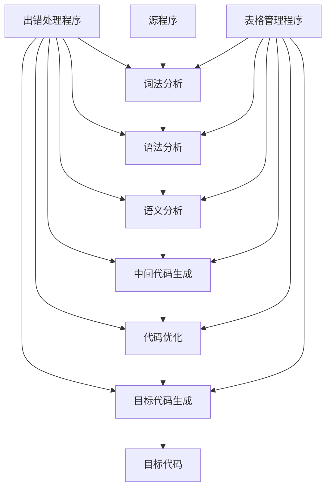

# 编译原理

## 文法

### 字符串方幂

递推关系

## ANTLR4

[ANTLR4权威指南 - 第5章 设计语法 - csguo - 博客园 (cnblogs.com)](https://www.cnblogs.com/csguo/p/7644272.html)

### 正则

| **语法**    | **描述**                    |
| ----------- | --------------------------- |
| *x*         | 匹配一个符号，规则或子规则x |
| *x y* … *z* | 匹配一个规则序列            |
| (…\|…\|…)   | 带有多个选项的子规则        |
| *x?*        | 匹配零次或一次x             |
| *x\**       | 匹配零次或多次x             |
| *x+*        | 匹配一次或多次x             |
| **r**:…;    | 定义规则r                   |
| r:…\|…\|…;  | 定义一个带有多个选项的规则r |

| **模式名称**       | **描述**                                                     |
| ------------------ | :----------------------------------------------------------- |
| **序列**           | 这是由符号和子短语组成的任意长的有限的序列，例如变量声明语法（类型后面加上标识符）以及整数列表等。下面是一些实现这种模式的例子：x y ... z    *// x followed by y, ..., z**'['* INT+ *']'*  *// Matlab vector of integers* |
| **带终结符的序列** | 这是由符号和子短语组成的任意长的，可能是空的序列，以一个符号结束，通常情况系这个符号是分号或换行符，例如C风格的编程语言中的语句以及以换行符终结的数据行。下面是一些实现这种模式的例子：(statement *';'*)*  *// Java statement list*(row *'\n'*)*    *// Lines of data* |
| **带分隔符的序列** | 这是由符号的子短语组成的任意长的非空的序列，用一个特定的符号分隔开，通常这个符号是逗号，分号或句号。例如函数参数列表，函数调用列表，或者是分开却不终止的程序语句。下面是一些实现这种模式的例子：expr (*','* expr)*   *// function call arguments*( expr (*','* expr)* )?*// optional function call arguments**'/'*? name (*'/'*name)*  *// simplified directory name*stat (*'.'* stat)*   *// SmallTalk statement list* |
| **选项**           | 这是由一系列可选择的短语组成的，例如类型说明，语句，表达式或者XML的标签。下面是一些实现这种模式的例子：type : *'int'* \| *'float'*;stat : ifstat \| whilestat \| *'return'*expr *';'* ;expr : *'('* expr *')'*\| INT \| ID ;tag : *'<'* Name attribute* *'>'*\| *'<' '/'* Name *'>'*; |
| **符号约束**       | 一个符号的出现需要另一个或多个子序列符号的出现来对应，例如小括号，中括号，大括号，尖括号的匹配等。下面是一些实现这种模式的例子：*'('* expr *')'*     *// nested expression*ID *'['* expr *']'*     *// array index**'{'* stat* *'}'* *// statements grouped in curlies**'<'* ID (*','*ID)* *'>' // generic type specifier* |
| **递归短语**       | 这是一种自相似的语言结构，例如表达式结构，Java类嵌套，代码块嵌套以及Python中的函数嵌套定义等。下面是一些实现这种模式的例子：expr : *'('* expr *')'*\| ID ;classDef : *'class'* ID *'{'*(classDef\|method\|field) *'}'* ; |

| **符号类别** | **描述和例子**                                               |
| ------------ | ------------------------------------------------------------ |
| 标点符号     | 对标点符号和运算符最简单的处理就是直接在语法规则中引用它们。call : ID *'('* exprList *')'* ;当然一些程序员更喜欢定义符号的标签规则，例如定义LP来代表左括号。call : ID LP exprList RP ;LP : *'('* ;RP : *')'* ; |
| 关键字       | 关键字就是保留的标识符，和标点符号的处理一样，我们可以直接引用也可以定义标签规则。returnStat : *'return'* expr *';'* |
| 标识符       | 标识符在几乎所有语言中看起来都差不多，可以再加一些改动，比如规定首字符以及设定是否可以使用Unicode字符。ID : ID_LETTER (ID_LETTER \| DIGIT)* ; *// From C language***fragment** ID_LETTER : *'a'*..*'z'*\|*'A'*..*'Z'*\|*'_'* ;**fragment** DIGIT : *'0'*..*'9'* ; |
| 数字         | 例子中是整数和简单浮点数的定义。INT : DIGIT+ ;FLOAT  : DIGIT+ *'.'* DIGIT*  \| *'.'* DIGIT+  ; |
| 字符串       | 匹配使用双引号引起来的字符串。STRING : *'"'* ( ESC \| . )*? *'"'* ;**fragment** ESC : *'\\'* [btnr*"\\] ; // \b, \t, \n etc...* |
| 注释         | 识别并丢弃注释。LINE_COMMENT : *'//'* .*? *'\n'* -> skip ;COMMENT     : *'/\*'* .*? *'\*/'* -> skip ; |
| 空白字符     | 匹配词法中的空白字符并丢弃这些字符。WS : [ \t\n\r]+ -> skip ; |

## 数据存储组织

| 内存           |
| -------------- |
| 栈【局部数据】 |
| 堆             |
| 静态Data       |
| code/text      |

## 期末内容

**选择题 10 * 2**  

**编译器结构：前后端包括，作用**

（1） 编译程序：如果源语言为高级语言，目标语言为某台计算机上的汇编语言或机器语言，则此翻译程序称为编译程序。

（2） 源程序：源语言编写的程序称为源程序。

（3） 目标程序：目标语言书写的程序称为目标程序。

（4） 编译程序的前端：它由这样一些阶段组成：这些阶段的工作主要依赖于源语言而与目标机无关。通常前端包括词法分析、语法分析、语义分析和中间代码生成这些阶 段，某些优化工作也可在前端做，也包括与前端每个阶段相关的出错处理工作和符号表管理等工作。

（5） 后端：指那些依赖于目标机而一般不依赖源语言，只与中间代码有关的那些阶段， 即目标代码生成，以及相关出错处理和符号表操作。

（6） 遍：是对源程序或其等价的中间语言程序从头到尾扫视并完成规定任务的过程。

**文法：定义要素，给定文法、串可以推导/生成语言，4种语言**

**词法分析：任务**

**自顶向下xxx语法分析：几个方法的意思**

**文法语义**

**存储动态静态**

**优化基本**：窥孔优化、局部优化、循环优化、全局优化

**计算题 5 * 10**

文法、串，给出推导树、过程等，nfa、dfa【不要求最小化】

ll分析-文法改造：消除左递归、提取公因子、first集等，

lr、slr、lr0：增广、闭包、自动机、状态转移树，判断属于那种文法

可能有简答题: 常用语法方法（自顶向下【递归下降、预测分析法、LL】、自底向下【移进和规约原理、LR(0)分析法】）\活动记录：作用、调用者、被调用者、存的信息\变量如何存储

**活动记录**：指运行栈上的栈帧。它在函数/过程调用时被创建；在函数/过程运行中被修改；在函数/过程返回时撤销。包含局部变量、函数实参、临时变量、返回值等数据信息及必要控制信息。调用者是，被调用者是函数/过程?。

翻译3地址指令、构造指令流图

基本块的入口：1.程序的第一条语句  2.跳转语句的跳转目标语句  3.条件跳转语句后面的相邻语句

**综合 2 * 15**
